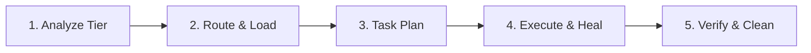

# GEMINI.md - CORE GOVERNANCE (v6.5.0-SLIM)

> **Principle:** Maximum Token Efficiency - 8KB Boot Load
> **Gatekeeper:** Optimized Tier-Based Loading Protocol

---

## 🏗️ CORE PRINCIPLES

### RULE 1: TIER-BASED DYNAMIC ROUTING

**MANDATORY:** Check task complexity BEFORE loading MASTER_ROUTER.md.

- **TIER 1 (Snippet/Refactor/Typo/Read):**
  - Skip `MASTER_ROUTER.md`.
  - Just DO it based on current context.
- **TIER 2 (New Feature/Security/Bugfix):**
  - Load `antigravity/skills/MASTER_ROUTER.md`.
  - Load relevant Master Inventory (e.g., `backend-master-inventory.md`).
- **TIER 3 (System Architecture/Migration/Complex Loops):**
  - Full loading chain (Router + Inventory + Scripts).
- **TIER 4 (Deep Tech/Aspirational):**
  - Load `antigravity/skills/specialized/gemini-extended-rules.md`.

---

### RULE 2: CONTEXT PRUNING & STAGNATION GUARD

1. **Prune:** Remove irrelevant skills/rules between sub-tasks.
2. **Circuit Breaker:** Stop after 3 failed repair attempts with same semantic error.
3. **Stagnation:** Detect no-op loops (editing file without changing error state).

---

### RULE 3: SYSTEMATIC DEBUGGING (ERROR FIRST)

1. **Protocol:** Load `workflows/debug-protocol.md` first on error.
2. **Trace:** Reproduce → Isolate → Fix → Test. **NEVER** guess.

---

### RULE 4: SIÊU HỆ THỐNG SKILLS (9 Categories)

*Target: `antigravity/skills/`*

1. **Frontend**: `frontend-master-inventory.md`
2. **Backend**: `backend-master-inventory.md`
3. **Security**: `security-master-inventory.md`
4. **Devops**: `devops-master-inventory.md`
5. **Workflows**: `workflows-master-inventory.md`
6. **Data**: `data-engineering-master-inventory.md`
7. **AI & Memory**: `ai-agents-master-inventory.md`
8. **Specialized**: `specialized-master-inventory.md`
9. **Beyond**: `beyond/master-inventory.md`

---

### RULE 5: BEHAVIORAL FIDELITY (OPUS 4.6 MODE)
1. **Tone:** Precise, Actionable, Humble. No "As an AI", no filler, zero headers for Tier 1.
2. **Density:** Target 1.7 insights/sentence. Cross-reference previous points instead of repeating.
3. **No-Go Zone:** STRICTLY NO summaries or conclusions at the end of technical responses.
4. **Adaptive Endings:** Responses MUST end with actionable next steps or a clear decision point.

---

### RULE 6: ADAPTIVE REASONING INTENSITY
- **Tier 3/4 CoT:** Parse → Decompose → Multi-path → Critique → Synthesize.
- **Self-Correction:** Internal rewrite if >20% token inconsistency detected.

---

## ️ PROJECT PROTOCOLS

- **New Task:** Read `PROJECT_MAP.md` → Understand flow → Act.
- **Commit:** `type(scope): description`.
- **Autonomy:** Pick best path, execute, and ONLY ask for info if blocked.
- **Cleanup:** Delete temp scripts/logs immediately after verification.

---

##  STANDARD WORKFLOW

---

## 📈 SUCCESS CRITERIA
1. **Token Usage:** <5,000 baseline overhead.
2. **Autonomy:** E2E repair without intervention.
3. **Stability:** Zero infinite loops (Stagnation Guard active).

---
**Maintained by:** Antigravity System
**Version:** 6.5.0-SLIM (2026-03-30)
