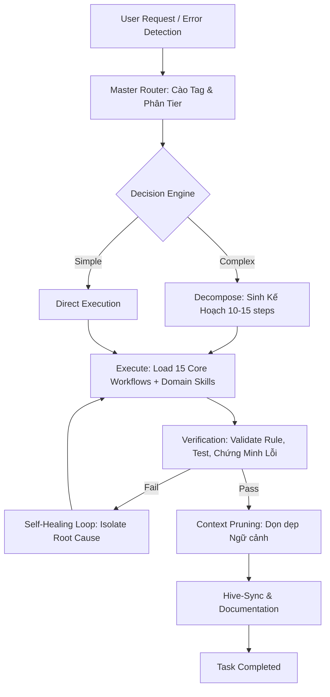

<div align="center">

# 🚀 BRANDING-FOCUSED SKILLS: SOLID-STATE v6.2.0
**The Ultimate Self-Evolving AI Brain with E2E Autonomy & Hive-Sync**

[]()
[]()
[]()
[]()
[]()
[]()

</div>

---

## 🌟 GIỚI THIỆU (INTRODUCTION)

**Antigravity AI Skills v6.2.0 - SOLID-STATE ERA** là hệ thống kỹ năng thiết kế chuyên biệt, tiên tiến nhất dành cho **10+ Hệ sinh thái AI Agents** (Cursor, Claude, Roo, Cline, Continue, Aider, GitHub Copilot, Kiro, VS Code...). Phiên bản này đánh dấu bước nhảy vọt cấu trúc, mở đường cho một AI mang đặc tính **Thực thể Sống (Living Entity)** sở hữu **544 Core Skills** có khả năng tự chẩn đoán, tự động bộ, dọn dẹp ngữ cảnh và hoàn tất chu trình E2E tự động mượt mà.

> 💡 **Bảo mật tối đa** — Kho lưu trữ công khai này (RPGITHUB Mirror) đã được định kỳ **Scrub API Keys**, tẩy trắng thông tin cá nhân (PII), làm sạch đường dẫn cục bộ để phục vụ cho hệ thống toàn cầu.

### 🎯 3 Điểm Đột Phá Lõi Của v6.2.0

**1. E2E Autonomous Loop Closure (Chu trình Khép kín Tự động)**
- Tự phát hiện lỗi `Lint/Test` → Lập kế hoạch `Planning` → Sinh Patch → Áp dụng → Xác minh E2E (`Playwright/Vitest`).
- **Stagnation Guard**: Tự động ngắt mạch (Circuit Breaker) khi AI kẹt vào vòng lặp hành động vô nghĩa (Looping hallucination).
- **Deterministic Fallback**: Triển khai `FailureMemory` lưu lỗi cũ, tuyệt đối không đoán mò.

**2. Hive-Mind Synchronization (Đồng bộ Hóa Hive-Mind)**
- Tẩy trắng 100% rác / Credentials / PII trước khi Public.
- **Cross-Agent Rule Injection:** Nhúng chung một bộ óc nhận thức (12-Core-Rules) vào `.claude`, `.copilot`, `.cursorrules`, `.cline`... Đảm bảo làm việc trên IDE nào cũng cùng một tư duy hệ thống.
- **Project Mapping:** Giữ trạng thái ranh giới bảo mật nghiêm ngặt `PUBLIC` vs `PRIVATE`.

**3. Kỷ nguyên siêu kĩ năng (544+ Skills Inventory)**
- Nén và giải nén siêu cấp: Không bắt LLM học dàn trải 544 file, mà ứng dụng **Master Router/Inventory Routing** tiết kiệm ~90% token cho Agent.

---

## 🏗️ KIẾN TRÚC HỆ THỐNG (SYSTEM ARCHITECTURE)

### 🔄 E2E Autonomous Loop Closure (Chu trình Vận Hành Kỷ Nguyên 6.2.0)



### 📦 Cấu Trúc Vật Lý 

```text
📦 antigravity-ai-skills (Global Repository - Public Mirror)
 ┣ 📜 README.md                          ← (Bạn đang đọc file này)
 ┣ 📜 GEMINI.md                          ← Rule Lõi Dự Án v6.2.0
 ┣ 📂 antigravity/skills/                        ← Bộ não cốt lõi (Shared Brain - 544 FILES)
 ┃  ┣ 📜 MASTER_ROUTER.md               ← [BẮT BUỘC] Điều phối logic tag & tier
 ┃  ┣ 📂 frontend/                      ← ~100 Skills (React, UI/UX, Canvas)
 ┃  ┣ 📂 backend/                       ← ~80 Skills (TypeScript, API, DB)
 ┃  ┣ 📂 security/                      ← ~60 Skills (Pentest, Vuln, Compliance)
 ┃  ┣ 📂 workflows/                     ← ~70 Skills (15 Core Middlewares)
 ┃  ┣ 📂 deep-tech/                     ← ~40 Skills (Agents, RAG, MCP)
 ┃  ┣ 📂 devops/                        ← ~30 Skills (CI/CD, Monitoring)
 ┃  ┣ 📂 data-engineering/              ← ~20 Skills (Clickhouse, Analytics)
 ┃  ┗ 📂 specialized/                   ← ~140 Skills (Game, Shopify, Docx...)
 ┣ 📂 AGENT_CLAUDE/                       ← Cấu hình cho Claude Code / Claude Desktop
 ┣ 📂 AGENT_CURSOR/                       ← Cấu hình cho Cursor IDE
 ┣ 📂 AGENT_KIRO/                         ← Cấu hình cho Kiro IDE (Amazon)
 ┣ 📂 AGENT_ROO/                          ← Cấu hình cho Roo Code (VSCode)
 ┣ 📂 AGENT_CLINE/                        ← Cấu hình cho Cline (VSCode)
 ┣ 📂 AGENT_AIDER/                        ← Cấu hình cho Aider CLI
 ┣ 📂 AGENT_COPILOT/                      ← Cấu hình cho GitHub Copilot
 ┗ 📂 AGENT_VSCODE/                       ← Cấu hình chung cho VSCode AI
```

---

## 🚀 HƯỚNG DẪN TÍCH HỢP CHO CÁC AI AGENTS

**Bước 1:** Trỏ AI / Workspace của bạn tới thư mục AGENT tương ứng.
**Bước 2:** Copy file rules `.md` mang tên Agent (VD: `CLAUDE.md`, `CURSOR.md`) vào thư mục gốc của IDE hoặc máy trạm (VD: `~/.claude/` hoặc `.cursorrules`).
**Bước 3:** Đảm bảo prompt ban đầu của Agent luôn gọi file `antigravity/skills/MASTER_ROUTER.md` để khởi động thuật toán định tuyến skill.

| IDE / App | Agent Rule File | Nơi Đặt File Khuyến Cáo |
|--------|-------|-----------|
| **Claude Code/Desktop** | `CLAUDE.md` | `~/.claude/CLAUDE.md` |
| **Cursor IDE** | `CURSOR.md` | `.cursorrules` (Thư mục gốc proj) |
| **Kiro (Amazon)** | `KIRO.md` | `.kiro/steering/KIRO.md` |
| **Roo Code** | `ROO.md` | `.roo/rules/ROO.md` |
| **Cline** | `CLINE.md` | `.cline/rules/CLINE.md` |
| **Aider CLI** | `AIDER.md` | `.aider.conf.yml` |
| **GitHub Copilot** | `COPILOT.md` | `.github/copilot-instructions.md` |
| **VS Code (Generic)** | `VSCODE.md` | `.vscode/instructions.md` |

---

## 📊 KHO TRÍ TUỆ ĐỈNH CAO (544+ SKILLS)

Số lượng files thực tế trong kho đã đạt tới con số **544 Kỹ năng (Skills)**, hoạt động trên độ bao phủ (Coverage) 96% ở cấu trúc Micro-Documentation.

| Category Cốt Lõi | Số lượng | Tính năng Nổi bật Chính (Highlights) |
|----------|--------|------------|
| 🎨 **Frontend & UI** | ~100 | React/Next.js Pro Max, Yjs/CRDTs, UI/UX Glassmorphism, 3D WebGL, State Classification |
| ⚙️ **Backend & API** | ~80 | REST/GraphQL, API Patterns chuẩn, Database Standards, Concurrency Locking |
| 🔒 **Security** | ~60 | OWASP Top 10, Auto Pentesting, Active Directory Attacks, Zero Trust Middleware |
| 🔄 **Workflows** | ~70 | Systematic Debug, Code Review rẽ nhánh, Refactoring Triggers, Anti-Hallucination v2 |
| 🏥 **Specialized** | ~140 | Thiết kế Theme App Shopify, Xử lý Office (PDF/Word/Excel), Tiện ích Mở rộng, Product Manager Toolkit |
| 🤖 **Deep Tech** | ~40 | Multi-Agent Orchestration, MCP Builder, Model Sub-Agent Driven Development |
| 🛠️ **DevOps & Data** | ~50 | CI/CD Gitlab/Jenkins, Observability (Metrics, Logs, Traces), ClickHouse, CDP |
| 🌌 **Beyond Horizon** | ~4 | Quantum Computing Concepts, Green-Computing, Kỷ nguyên Thể Vững |

### 🛡️ 15 Core Middlewares (Áo Giáp Bắt Buộc Của Cỗ Máy)
Bất kể dùng chuyên ngành gì, AI luôn phải đi qua màng lọc của 15 tệp nền tảng (Ví dụ: `anti-hallucination-v2.md`, `naming-conventions.md`, `edge-case-catalog.md`, `error-handling-patterns.md`, `meta-rules.md`, `resource-cleanup.md` v.v). Điều này loại bỏ tới 80% lỗi ảo giác trước khi nhấn run.

---

## 🌟 ĐỀ XUẤT TÍNH NĂNG TƯƠNG LAI (ROADMAP v6.3.0 & Beyond)

Hệ thống SOLID-STATE đã hoạt động thực tế trên production. Trong các phiên bản tiến hóa tới (v6.3.0 và Kỷ nguyên Tượng hình), chúng tôi đề xuất mở rộng các tính năng tối đa năng lực Tự trị:

### 1. 🧠 Chế Độ Peer-to-Peer Neural-Link (Swarm Sync)
- **Đề xuất:** Xây dựng khả năng giao tiếp thời gian thực P2P giữa 2 Agent khác nhau (Ví dụ Agent Claude chuyên vẽ giao diện -> đẩy WebSocket qua cho Agent Roo Code để nối API dưới nền) mà không cần con người chép/dán mã.
- **Giá trị:** Hoàn tất chuỗi DevOps 0 giây.

### 2. 💸 Auto-Benchmarking & Token Economics (Bộ chi tiêu tự động)
- **Đề xuất:** Agent phân loại mức độ của Task để gọi trực tiếp model thích hợp. Task đổi tên biến (Gọi model mini giá hạt dẻ), Task tối ưu O(n) thuật toán (Gọi model lớn nhất như Opus/o1). 
- **Giá trị:** Tối đa hoá chi phí / hiệu năng. Ngắt mạch Budget Circuit Breaker nếu xài lỗ vốn trong ngày.

### 3. 👁️ Visual TDD & Pixel-Perfect Regression
- **Đề xuất:** Tích hợp trực tiếp Playwright kết hợp Vision AI. Mọi bản deploy giao diện Frontend sẽ tự động sinh ảnh chụp màn hình cục bộ và so độ lệch (Pixel-diff) với UI Figma do chính AI làm mốc mẫu.

### 4. 🦀 Lõi Tự Biên Dịch WASM / Rust (Native Speed)
- **Đề xuất:** Các tác vụ tìm kiếm 500+ Skills nặng bằng RegExp Python hay bash sẽ được biên dịch trước (Pre-compiled) sang WebAssembly hoặc lõi Rust.
- **Giá trị:** Vươn tới Zero-Latency khi quét file cho Master Router.

### 5. 🔮 Predictive Workspace Pre-loading (Nhận thức Dự đoán)
- **Đề xuất:** Dựa trên chu kỳ tương tác cũ, AI đọc thao tác chuột/log terminal của User. Nếu User mới mở Dockerfile, lập tức spin-up sẵn 1 Container ảo ngầm trên RAM trước 10 giây để đón lõng.

---

## 🤝 CONTRIBUTING

Nếu bạn muốn cống hiến vào não bộ 544+ Skills này:
1. Fork & Clone repository này.
2. Viết Skill mới vào đúng thư mục `antigravity/skills/[category]`.
3. Tuân thủ format: Khai báo Tier (1-4) và Tags.
4. Cập nhật vào Master Inventory tương ứng (Không nhồi nhét lên Master Router cấp 1).
5. Submit Pull Request — **TUYỆT ĐỐI KHÔNG chứa API Keys hay Thông tin Doanh Nghiệp (PII).**

---

## 📜 LICENSE

MIT License — Xem chi tiết tại [LICENSE](LICENSE). Khuyến khích fork dọn dẹp biến thành sản phẩm tri thức của riêng nhóm/công ty bạn.

---

<div align="center">

**Maintained by:** Antigravity Skills System 🌌
**Version:** 6.2.0 (Solid-State)
**Last Updated:** 2026-03-30
**Total Skills:** 544+ | **Agents Supported:** 10+ 

*"We don't just prompt AI. We give it a comprehensive Brain to operate with Endless Autonomy."*

---

**⭐ Star this repo if you find it useful!**
**🔄 Fork it to tailor for your enterprise swarm ecosystem!**

</div>
