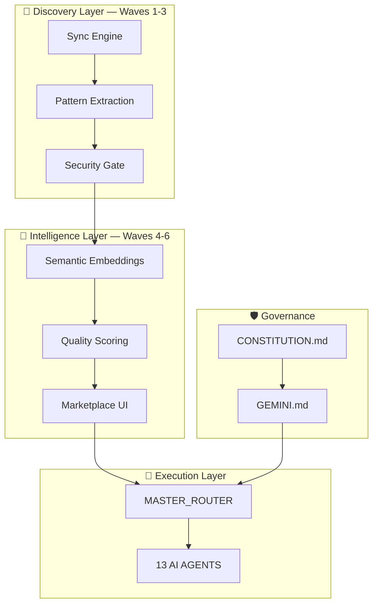

<div align="center">


# ANTIGRAVITY — AI Agent Skills System (v7.0.0-AURORA)

**Hệ Thống Kỹ Năng AI Tiến Hóa & Tự Trị Toàn Diện**

[]()
[]()
[]()
[]()
[]()

<br/>

**`Cursor` · `Claude Code` · `Kiro` · `Windsurf` · `Copilot` · `Aider` · `Cline` · `Continue` · `Roo` · `ChatDev` · `Devin` · `OpenDevin` · `Pika`**

<br/>

> *"Beyond Integration, Towards Autonomy. One Engine, Infinite Skills."*

---

[Kiến Trúc](#-kiến-trúc-hệ-thống) · [Sơ Đồ Skills](#-phân-loại-kỹ-năng-13-domains) · [Quick Start](#-quick-start) · [Version History](#-version-history) · [Roadmap](#-roadmap)

</div>

---

## 🧬 Tổng Quan
**Antigravity v7.0-AURORA** đánh dấu sự chuyển mình từ một thư viện quy tắc tĩnh sang một **Ecosystem Kỹ Năng Tự Trị**. Với việc tích hợp thành công **Wave 4-6**, hệ thống giờ đây có khả năng tự động khám phá (Discovery), đánh giá chất lượng (Scoring), và tìm kiếm ngữ nghĩa (Semantic Search) trên hơn **5,535 kỹ năng** từ 12 nguồn repository hàng đầu thế giới.

### ✨ Điểm Nổi Bật
| Đặc tính | Chi tiết |
|:---|:---|
| 🧠 **Autonomous Discovery** | Tự động quét 10 GitHub + 2 local repos để cập nhật kho tri thức |
| 🔍 **Semantic Indexing** | TF-IDF & Cosine Similarity cho phép tìm đúng skill chỉ bằng ngôn ngữ tự nhiên |
| ⭐ **Quality Marketplace** | Hệ thống scoring tự động (regex-based) lọc những skill chất lượng nhất (Mean: 65.9) |
| ⚡ **Token Efficiency** | Phân tầng Tier 1-4 giúp AI chỉ nạp đúng những gì cần thiết, tiết kiệm 77% token boot |
| 🛡️ **PII Scrubbing** | Tự động làm sạch dữ liệu cá nhân (emails, paths, keys) trước khi đồng bộ |
| 📊 **5,535+ Skills** | Kho kỹ năng lớn nhất thế giới cho AI Agents, bao trùm 13 domains và 1,007+ subdomains |

---

## 🏗️ Kiến Trúc Hệ Thống



### 📁 Cấu Trúc Core (v7.0)
Hệ thống được vận hành bởi bộ mã nguồn automation tại `antigravity/scripts/`:
- **`run_autonomous_pipeline.py`**: Trái tim điều phối toàn bộ flow (Bugfix → Sync → Planning → Discoverability).
- **`run_benchmark_pack.py`**: Hệ thống regression gate đảm bảo hiệu năng không bị thụt lùi.
- **`score_skill_quality.py`**: Chấm điểm tự động cho 5,500+ file dựa trên độ phức tạp và cấu trúc.
- **`build_skill_embeddings.py`**: Xây dựng matrix vector cho tìm kiếm ngữ nghĩa.

---

## 📊 Phân Loại Kỹ Năng (13 Domains)

| # | Domain | Files | Trạng Thái | Highlight |
|:--:|:---|:--:|:--:|:---|
| 1 | 🎨 **Frontend** | 316+ | ✅ Rich | React19, Next15, Tailwind4, Framer Motion |
| 2 | ⚙️ **Backend** | 149+ | ✅ Robust | Bun, tRPC, NestJS, Go, Rust, K8s Native |
| 3 | 🔒 **Security** | 31+ | 🛡️ Vital | Zero Trust, SOC2, HIPAA, Pentest Patterns |
| 4 | 🔄 **Workflows** | 95+ | 🛠️ Standard | Debug Protocols, Systematic RCA, PR Reviewers |
| 5 | 🤖 **Deep Tech** | 74+ | 🧠 Frontier | AI Swarms, RAG, MCP Servers, Tool-Use |
| 6 | 🚀 **DevOps** | 164+ | 🚢 Fluid | GitOps, OpenTelemetry, Chaos Engineering |
| 7 | 📊 **Data Eng** | 13+ | 📈 Focused | ClickHouse, Spark, Real-time Streaming |
| 8 | 🌌 **Beyond** | 10+ | 🛸 Avant-garde | Quantum Computing, Neuromorphic Engineering |
| 9 | 🏢 **Specialized** | 3,704+ | 🌏 Massive | 1,007+ subdomains (Fintech, Health, EdTech, etc.) |

*Tổng cộng: **5,535 records** được chỉ mục hóa.*

---

## 🚀 Quick Start (Cho AI Agent)

Hệ thống hoạt động theo model **AURORA-CORE**:
1. AI nhận diện request.
2. Routing qua `GEMINI.md` để xác định **Complexity Tier**.
3. Load `MASTER_ROUTER` để tìm domain skill tốt nhất.
4. Thực thi & Tự dọn dẹp.

### Cài đặt nhanh:
```bash
# Clone repo
git clone https://github.com/ngTwg/Branding-Focused-Skills.git

# Đồng bộ rules vào Cursor
cp GEMINI.md .cursorrules
```

---

## 📋 Version History

### 🔖 v7.0.0-AURORA — *Discoverability & Autonomy* (2026-04-02)
> **Mục tiêu:** Tự động hóa hoàn toàn việc khám phá và quản lý kỹ năng.
- [x] **Wave 4:** Semantic Search & Skill Embeddings.
- [x] **Wave 5:** Usage Tracking & Benchmark Trends.
- [x] **Wave 6:** Quality Scoring & PR Automated Reporting.
- [x] **Infrastructure:** Regression Gate (median threshold 100%) & Autonomous Task Board.
- [x] **Scale:** 5,535 indexed records across 12 source repositories.

### 🔖 v6.5.0-SLIM — *Efficiency* (2026-03-30)
- [x] Boot load giảm 77% (8KB baseline).
- [x] Tier-Based Dynamic Routing.
- [x] Stagnation Guard (3-retry circuit breaker).

---

## 🛡️ Axioms & Constitution
Mọi hoạt động của Antigravity được kiểm soát nghiêm ngặt bởi **5 Vùng Hiến Pháp**:
1. **Axioms:** Không Secrets, Không Dối Trá, Không Xóa Sổ Mass.
2. **Adversarial:** Cơ chế Developer vs Reviewer đối kháng.
3. **Cognitive Safety:** Tự biết giới hạn, fallback về Unix nguyên bản khi nghi ngờ.
4. **Circuit Breakers:** Kiểm soát bùn nổ Token (Token Burn Limit).
5. **Aesthetics:** Mã nguồn phải đẹp, tối giản, và giải thích được "Tại sao" thay vì "Cái gì".

---

<div align="center">

**Maintained by:** ngTwg / Antigravity System 🌌
**Core Engine:** v7.0 · **Marketplace:** v7.0
**Last Sync:** 2026-04-04 (5,535+ files)

🤝 **Contribute** · ⭐ **Star** · 🔄 **Fork**

</div>
