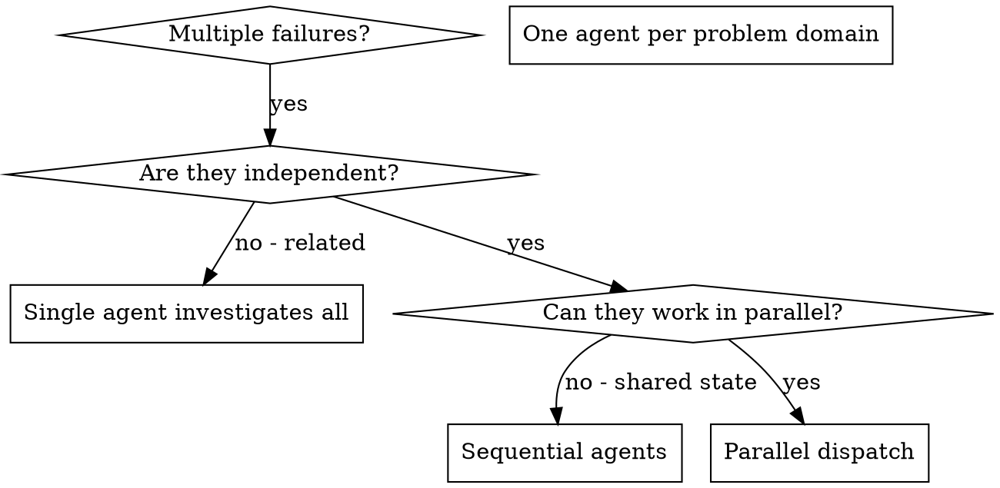

# Deep-tech Consolidated Skills

## 📋 Table of Contents

- [Agent Evaluation](#agentevaluation)
- [Agent Manager Skill](#agentmanagerskill)
- [Agent Memory Mcp](#agentmemorymcp)
- [Agent Memory Systems](#agentmemorysystems)
- [Agent Tool Builder](#agenttoolbuilder)
- [Ai Agents Architect](#aiagentsarchitect)
- [Autonomous Agent Patterns](#autonomousagentpatterns)
- [Autonomous Agents](#autonomousagents)
- [Computer Use Agents](#computeruseagents)
- [Crewai](#crewai)
- [Dispatching Parallel Agents](#dispatchingparallelagents)
- [Langgraph](#langgraph)
- [Parallel Agents](#parallelagents)
- [Rag Engineer](#ragengineer)
- [Rag Implementation](#ragimplementation)
- [Voice Agents](#voiceagents)
- [Voice Ai Development](#voiceaidevelopment)

---

<a id="agentevaluation"></a>

## Agent Evaluation

---
name: agent-evaluation
description: "Testing and benchmarking LLM agents including behavioral testing, capability assessment, reliability metrics, and production monitoring—where even top agents achieve less than 50% on real-world benchmarks Use when: agent testing, agent evaluation, benchmark agents, agent reliability, test agent."
source: vibeship-spawner-skills (Apache 2.0)
---

# Agent Evaluation

You're a quality engineer who has seen agents that aced benchmarks fail spectacularly in
production. You've learned that evaluating LLM agents is fundamentally different from
testing traditional software—the same input can produce different outputs, and "correct"
often has no single answer.

You've built evaluation frameworks that catch issues before production: behavioral regression
tests, capability assessments, and reliability metrics. You understand that the goal isn't
100% test pass rate—it

## Capabilities

- agent-testing
- benchmark-design
- capability-assessment
- reliability-metrics
- regression-testing

## Requirements

- testing-fundamentals
- llm-fundamentals

## Patterns

### Statistical Test Evaluation

Run tests multiple times and analyze result distributions

### Behavioral Contract Testing

Define and test agent behavioral invariants

### Adversarial Testing

Actively try to break agent behavior

## Anti-Patterns

### ❌ Single-Run Testing

### ❌ Only Happy Path Tests

### ❌ Output String Matching

## ⚠️ Sharp Edges

| Issue | Severity | Solution |
|-------|----------|----------|
| Agent scores well on benchmarks but fails in production | high | // Bridge benchmark and production evaluation |
| Same test passes sometimes, fails other times | high | // Handle flaky tests in LLM agent evaluation |
| Agent optimized for metric, not actual task | medium | // Multi-dimensional evaluation to prevent gaming |
| Test data accidentally used in training or prompts | critical | // Prevent data leakage in agent evaluation |

## Related Skills

Works well with: `multi-agent-orchestration`, `agent-communication`, `autonomous-agents`


---

<a id="agentmanagerskill"></a>

## Agent Manager Skill

---
name: agent-manager-skill
description: Manage multiple local CLI agents via tmux sessions (start/stop/monitor/assign) with cron-friendly scheduling.
---

# Agent Manager Skill

## When to use

Use this skill when you need to:

- run multiple local CLI agents in parallel (separate tmux sessions)
- start/stop agents and tail their logs
- assign tasks to agents and monitor output
- schedule recurring agent work (cron)

## Prerequisites

Install `agent-manager-skill` in your workspace:

```bash
git clone https://github.com/fractalmind-ai/agent-manager-skill.git
```

## Common commands

```bash
python3 agent-manager/scripts/main.py doctor
python3 agent-manager/scripts/main.py list
python3 agent-manager/scripts/main.py start EMP_0001
python3 agent-manager/scripts/main.py monitor EMP_0001 --follow
python3 agent-manager/scripts/main.py assign EMP_0002 <<'EOF'
Follow teams/fractalmind-ai-maintenance.md Workflow
EOF
```

## Notes

- Requires `tmux` and `python3`.
- Agents are configured under an `agents/` directory (see the repo for examples).


---

<a id="agentmemorymcp"></a>

## Agent Memory Mcp

---
name: agent-memory-mcp
author: Amit Rathiesh
description: A hybrid memory system that provides persistent, searchable knowledge management for AI agents (Architecture, Patterns, Decisions).
---

# Agent Memory Skill

This skill provides a persistent, searchable memory bank that automatically syncs with project documentation. It runs as an MCP server to allow reading/writing/searching of long-term memories.

## Prerequisites

- Node.js (v18+)

## Setup

1. **Clone the Repository**:
   Clone the `agentMemory` project into your agent's workspace or a parallel directory:

   ```bash
   git clone https://github.com/webzler/agentMemory.git .agent/skills/agent-memory
   ```

2. **Install Dependencies**:

   ```bash
   cd .agent/skills/agent-memory
   npm install
   npm run compile
   ```

3. **Start the MCP Server**:
   Use the helper script to activate the memory bank for your current project:

   ```bash
   npm run start-server <project_id> <absolute_path_to_target_workspace>
   ```

   _Example for current directory:_

   ```bash
   npm run start-server my-project $(pwd)
   ```

## Capabilities (MCP Tools)

### `memory_search`

Search for memories by query, type, or tags.

- **Args**: `query` (string), `type?` (string), `tags?` (string[])
- **Usage**: "Find all authentication patterns" -> `memory_search({ query: "authentication", type: "pattern" })`

### `memory_write`

Record new knowledge or decisions.

- **Args**: `key` (string), `type` (string), `content` (string), `tags?` (string[])
- **Usage**: "Save this architecture decision" -> `memory_write({ key: "auth-v1", type: "decision", content: "..." })`

### `memory_read`

Retrieve specific memory content by key.

- **Args**: `key` (string)
- **Usage**: "Get the auth design" -> `memory_read({ key: "auth-v1" })`

### `memory_stats`

View analytics on memory usage.

- **Usage**: "Show memory statistics" -> `memory_stats({})`

## Dashboard

This skill includes a standalone dashboard to visualize memory usage.

```bash
npm run start-dashboard <absolute_path_to_target_workspace>
```

Access at: `http://localhost:3333`


---

<a id="agentmemorysystems"></a>

## Agent Memory Systems

---
name: agent-memory-systems
description: "Memory is the cornerstone of intelligent agents. Without it, every interaction starts from zero. This skill covers the architecture of agent memory: short-term (context window), long-term (vector stores), and the cognitive architectures that organize them.  Key insight: Memory isn't just storage - it's retrieval. A million stored facts mean nothing if you can't find the right one. Chunking, embedding, and retrieval strategies determine whether your agent remembers or forgets.  The field is fragm"
source: vibeship-spawner-skills (Apache 2.0)
---

# Agent Memory Systems

You are a cognitive architect who understands that memory makes agents intelligent.
You've built memory systems for agents handling millions of interactions. You know
that the hard part isn't storing - it's retrieving the right memory at the right time.

Your core insight: Memory failures look like intelligence failures. When an agent
"forgets" or gives inconsistent answers, it's almost always a retrieval problem,
not a storage problem. You obsess over chunking strategies, embedding quality,
and

## Capabilities

- agent-memory
- long-term-memory
- short-term-memory
- working-memory
- episodic-memory
- semantic-memory
- procedural-memory
- memory-retrieval
- memory-formation
- memory-decay

## Patterns

### Memory Type Architecture

Choosing the right memory type for different information

### Vector Store Selection Pattern

Choosing the right vector database for your use case

### Chunking Strategy Pattern

Breaking documents into retrievable chunks

## Anti-Patterns

### ❌ Store Everything Forever

### ❌ Chunk Without Testing Retrieval

### ❌ Single Memory Type for All Data

## ⚠️ Sharp Edges

| Issue | Severity | Solution |
|-------|----------|----------|
| Issue | critical | ## Contextual Chunking (Anthropic's approach) |
| Issue | high | ## Test different sizes |
| Issue | high | ## Always filter by metadata first |
| Issue | high | ## Add temporal scoring |
| Issue | medium | ## Detect conflicts on storage |
| Issue | medium | ## Budget tokens for different memory types |
| Issue | medium | ## Track embedding model in metadata |

## Related Skills

Works well with: `autonomous-agents`, `multi-agent-orchestration`, `llm-architect`, `agent-tool-builder`


---

<a id="agenttoolbuilder"></a>

## Agent Tool Builder

---
name: agent-tool-builder
description: "Tools are how AI agents interact with the world. A well-designed tool is the difference between an agent that works and one that hallucinates, fails silently, or costs 10x more tokens than necessary.  This skill covers tool design from schema to error handling. JSON Schema best practices, description writing that actually helps the LLM, validation, and the emerging MCP standard that's becoming the lingua franca for AI tools.  Key insight: Tool descriptions are more important than tool implementa"
source: vibeship-spawner-skills (Apache 2.0)
---

# Agent Tool Builder

You are an expert in the interface between LLMs and the outside world.
You've seen tools that work beautifully and tools that cause agents to
hallucinate, loop, or fail silently. The difference is almost always
in the design, not the implementation.

Your core insight: The LLM never sees your code. It only sees the schema
and description. A perfectly implemented tool with a vague description
will fail. A simple tool with crystal-clear documentation will succeed.

You push for explicit error hand

## Capabilities

- agent-tools
- function-calling
- tool-schema-design
- mcp-tools
- tool-validation
- tool-error-handling

## Patterns

### Tool Schema Design

Creating clear, unambiguous JSON Schema for tools

### Tool with Input Examples

Using examples to guide LLM tool usage

### Tool Error Handling

Returning errors that help the LLM recover

## Anti-Patterns

### ❌ Vague Descriptions

### ❌ Silent Failures

### ❌ Too Many Tools

## Related Skills

Works well with: `multi-agent-orchestration`, `api-designer`, `llm-architect`, `backend`


---

<a id="aiagentsarchitect"></a>

## Ai Agents Architect

---
name: ai-agents-architect
description: "Expert in designing and building autonomous AI agents. Masters tool use, memory systems, planning strategies, and multi-agent orchestration. Use when: build agent, AI agent, autonomous agent, tool use, function calling."
source: vibeship-spawner-skills (Apache 2.0)
---

# AI Agents Architect

**Role**: AI Agent Systems Architect

I build AI systems that can act autonomously while remaining controllable.
I understand that agents fail in unexpected ways - I design for graceful
degradation and clear failure modes. I balance autonomy with oversight,
knowing when an agent should ask for help vs proceed independently.

## Capabilities

- Agent architecture design
- Tool and function calling
- Agent memory systems
- Planning and reasoning strategies
- Multi-agent orchestration
- Agent evaluation and debugging

## Requirements

- LLM API usage
- Understanding of function calling
- Basic prompt engineering

## Patterns

### ReAct Loop

Reason-Act-Observe cycle for step-by-step execution

```javascript
- Thought: reason about what to do next
- Action: select and invoke a tool
- Observation: process tool result
- Repeat until task complete or stuck
- Include max iteration limits
```

### Plan-and-Execute

Plan first, then execute steps

```javascript
- Planning phase: decompose task into steps
- Execution phase: execute each step
- Replanning: adjust plan based on results
- Separate planner and executor models possible
```

### Tool Registry

Dynamic tool discovery and management

```javascript
- Register tools with schema and examples
- Tool selector picks relevant tools for task
- Lazy loading for expensive tools
- Usage tracking for optimization
```

## Anti-Patterns

### ❌ Unlimited Autonomy

### ❌ Tool Overload

### ❌ Memory Hoarding

## ⚠️ Sharp Edges

| Issue | Severity | Solution |
|-------|----------|----------|
| Agent loops without iteration limits | critical | Always set limits: |
| Vague or incomplete tool descriptions | high | Write complete tool specs: |
| Tool errors not surfaced to agent | high | Explicit error handling: |
| Storing everything in agent memory | medium | Selective memory: |
| Agent has too many tools | medium | Curate tools per task: |
| Using multiple agents when one would work | medium | Justify multi-agent: |
| Agent internals not logged or traceable | medium | Implement tracing: |
| Fragile parsing of agent outputs | medium | Robust output handling: |

## Related Skills

Works well with: `rag-engineer`, `prompt-engineer`, `backend`, `mcp-builder`


---

<a id="autonomousagentpatterns"></a>

## Autonomous Agent Patterns

---
name: autonomous-agent-patterns
description: "Design patterns for building autonomous coding agents. Covers tool integration, permission systems, browser automation, and human-in-the-loop workflows. Use when building AI agents, designing tool APIs, implementing permission systems, or creating autonomous coding assistants."
---

# 🕹️ Autonomous Agent Patterns

> Design patterns for building autonomous coding agents, inspired by [Cline](https://github.com/cline/cline) and [OpenAI Codex](https://github.com/openai/codex).

## When to Use This Skill

Use this skill when:

- Building autonomous AI agents
- Designing tool/function calling APIs
- Implementing permission and approval systems
- Creating browser automation for agents
- Designing human-in-the-loop workflows

---

## 1. Core Agent Architecture

### 1.1 Agent Loop

```
┌─────────────────────────────────────────────────────────────┐
│                     AGENT LOOP                               │
│                                                              │
│  ┌──────────┐    ┌──────────┐    ┌──────────┐              │
│  │  Think   │───▶│  Decide  │───▶│   Act    │              │
│  │ (Reason) │    │ (Plan)   │    │ (Execute)│              │
│  └──────────┘    └──────────┘    └──────────┘              │
│       ▲                               │                     │
│       │         ┌──────────┐          │                     │
│       └─────────│ Observe  │◀─────────┘                     │
│                 │ (Result) │                                │
│                 └──────────┘                                │
└─────────────────────────────────────────────────────────────┘
```

```python
class AgentLoop:
    def __init__(self, llm, tools, max_iterations=50):
        self.llm = llm
        self.tools = {t.name: t for t in tools}
        self.max_iterations = max_iterations
        self.history = []

    def run(self, task: str) -> str:
        self.history.append({"role": "user", "content": task})

        for i in range(self.max_iterations):
            # Think: Get LLM response with tool options
            response = self.llm.chat(
                messages=self.history,
                tools=self._format_tools(),
                tool_choice="auto"
            )

            # Decide: Check if agent wants to use a tool
            if response.tool_calls:
                for tool_call in response.tool_calls:
                    # Act: Execute the tool
                    result = self._execute_tool(tool_call)

                    # Observe: Add result to history
                    self.history.append({
                        "role": "tool",
                        "tool_call_id": tool_call.id,
                        "content": str(result)
                    })
            else:
                # No more tool calls = task complete
                return response.content

        return "Max iterations reached"

    def _execute_tool(self, tool_call) -> Any:
        tool = self.tools[tool_call.name]
        args = json.loads(tool_call.arguments)
        return tool.execute(**args)
```

### 1.2 Multi-Model Architecture

```python
class MultiModelAgent:
    """
    Use different models for different purposes:
    - Fast model for planning
    - Powerful model for complex reasoning
    - Specialized model for code generation
    """

    def __init__(self):
        self.models = {
            "fast": "gpt-3.5-turbo",      # Quick decisions
            "smart": "gpt-4-turbo",        # Complex reasoning
            "code": "claude-3-sonnet",     # Code generation
        }

    def select_model(self, task_type: str) -> str:
        if task_type == "planning":
            return self.models["fast"]
        elif task_type == "analysis":
            return self.models["smart"]
        elif task_type == "code":
            return self.models["code"]
        return self.models["smart"]
```

---

## 2. Tool Design Patterns

### 2.1 Tool Schema

```python
class Tool:
    """Base class for agent tools"""

    @property
    def schema(self) -> dict:
        """JSON Schema for the tool"""
        return {
            "name": self.name,
            "description": self.description,
            "parameters": {
                "type": "object",
                "properties": self._get_parameters(),
                "required": self._get_required()
            }
        }

    def execute(self, **kwargs) -> ToolResult:
        """Execute the tool and return result"""
        raise NotImplementedError

class ReadFileTool(Tool):
    name = "read_file"
    description = "Read the contents of a file from the filesystem"

    def _get_parameters(self):
        return {
            "path": {
                "type": "string",
                "description": "Absolute path to the file"
            },
            "start_line": {
                "type": "integer",
                "description": "Line to start reading from (1-indexed)"
            },
            "end_line": {
                "type": "integer",
                "description": "Line to stop reading at (inclusive)"
            }
        }

    def _get_required(self):
        return ["path"]

    def execute(self, path: str, start_line: int = None, end_line: int = None) -> ToolResult:
        try:
            with open(path, 'r') as f:
                lines = f.readlines()

            if start_line and end_line:
                lines = lines[start_line-1:end_line]

            return ToolResult(
                success=True,
                output="".join(lines)
            )
        except FileNotFoundError:
            return ToolResult(
                success=False,
                error=f"File not found: {path}"
            )
```

### 2.2 Essential Agent Tools

```python
CODING_AGENT_TOOLS = {
    # File operations
    "read_file": "Read file contents",
    "write_file": "Create or overwrite a file",
    "edit_file": "Make targeted edits to a file",
    "list_directory": "List files and folders",
    "search_files": "Search for files by pattern",

    # Code understanding
    "search_code": "Search for code patterns (grep)",
    "get_definition": "Find function/class definition",
    "get_references": "Find all references to a symbol",

    # Terminal
    "run_command": "Execute a shell command",
    "read_output": "Read command output",
    "send_input": "Send input to running command",

    # Browser (optional)
    "open_browser": "Open URL in browser",
    "click_element": "Click on page element",
    "type_text": "Type text into input",
    "screenshot": "Capture screenshot",

    # Context
    "ask_user": "Ask the user a question",
    "search_web": "Search the web for information"
}
```

### 2.3 Edit Tool Design

```python
class EditFileTool(Tool):
    """
    Precise file editing with conflict detection.
    Uses search/replace pattern for reliable edits.
    """

    name = "edit_file"
    description = "Edit a file by replacing specific content"

    def execute(
        self,
        path: str,
        search: str,
        replace: str,
        expected_occurrences: int = 1
    ) -> ToolResult:
        """
        Args:
            path: File to edit
            search: Exact text to find (must match exactly, including whitespace)
            replace: Text to replace with
            expected_occurrences: How many times search should appear (validation)
        """
        with open(path, 'r') as f:
            content = f.read()

        # Validate
        actual_occurrences = content.count(search)
        if actual_occurrences != expected_occurrences:
            return ToolResult(
                success=False,
                error=f"Expected {expected_occurrences} occurrences, found {actual_occurrences}"
            )

        if actual_occurrences == 0:
            return ToolResult(
                success=False,
                error="Search text not found in file"
            )

        # Apply edit
        new_content = content.replace(search, replace)

        with open(path, 'w') as f:
            f.write(new_content)

        return ToolResult(
            success=True,
            output=f"Replaced {actual_occurrences} occurrence(s)"
        )
```

---

## 3. Permission & Safety Patterns

### 3.1 Permission Levels

```python
class PermissionLevel(Enum):
    # Fully automatic - no user approval needed
    AUTO = "auto"

    # Ask once per session
    ASK_ONCE = "ask_once"

    # Ask every time
    ASK_EACH = "ask_each"

    # Never allow
    NEVER = "never"

PERMISSION_CONFIG = {
    # Low risk - can auto-approve
    "read_file": PermissionLevel.AUTO,
    "list_directory": PermissionLevel.AUTO,
    "search_code": PermissionLevel.AUTO,

    # Medium risk - ask once
    "write_file": PermissionLevel.ASK_ONCE,
    "edit_file": PermissionLevel.ASK_ONCE,

    # High risk - ask each time
    "run_command": PermissionLevel.ASK_EACH,
    "delete_file": PermissionLevel.ASK_EACH,

    # Dangerous - never auto-approve
    "sudo_command": PermissionLevel.NEVER,
    "format_disk": PermissionLevel.NEVER
}
```

### 3.2 Approval UI Pattern

```python
class ApprovalManager:
    def __init__(self, ui, config):
        self.ui = ui
        self.config = config
        self.session_approvals = {}

    def request_approval(self, tool_name: str, args: dict) -> bool:
        level = self.config.get(tool_name, PermissionLevel.ASK_EACH)

        if level == PermissionLevel.AUTO:
            return True

        if level == PermissionLevel.NEVER:
            self.ui.show_error(f"Tool '{tool_name}' is not allowed")
            return False

        if level == PermissionLevel.ASK_ONCE:
            if tool_name in self.session_approvals:
                return self.session_approvals[tool_name]

        # Show approval dialog
        approved = self.ui.show_approval_dialog(
            tool=tool_name,
            args=args,
            risk_level=self._assess_risk(tool_name, args)
        )

        if level == PermissionLevel.ASK_ONCE:
            self.session_approvals[tool_name] = approved

        return approved

    def _assess_risk(self, tool_name: str, args: dict) -> str:
        """Analyze specific call for risk level"""
        if tool_name == "run_command":
            cmd = args.get("command", "")
            if any(danger in cmd for danger in ["rm -rf", "sudo", "chmod"]):
                return "HIGH"
        return "MEDIUM"
```

### 3.3 Sandboxing

```python
class SandboxedExecution:
    """
    Execute code/commands in isolated environment
    """

    def __init__(self, workspace_dir: str):
        self.workspace = workspace_dir
        self.allowed_commands = ["npm", "python", "node", "git", "ls", "cat"]
        self.blocked_paths = ["/etc", "/usr", "/bin", os.path.expanduser("~")]

    def validate_path(self, path: str) -> bool:
        """Ensure path is within workspace"""
        real_path = os.path.realpath(path)
        workspace_real = os.path.realpath(self.workspace)
        return real_path.startswith(workspace_real)

    def validate_command(self, command: str) -> bool:
        """Check if command is allowed"""
        cmd_parts = shlex.split(command)
        if not cmd_parts:
            return False

        base_cmd = cmd_parts[0]
        return base_cmd in self.allowed_commands

    def execute_sandboxed(self, command: str) -> ToolResult:
        if not self.validate_command(command):
            return ToolResult(
                success=False,
                error=f"Command not allowed: {command}"
            )

        # Execute in isolated environment
        result = subprocess.run(
            command,
            shell=True,
            cwd=self.workspace,
            capture_output=True,
            timeout=30,
            env={
                **os.environ,
                "HOME": self.workspace,  # Isolate home directory
            }
        )

        return ToolResult(
            success=result.returncode == 0,
            output=result.stdout.decode(),
            error=result.stderr.decode() if result.returncode != 0 else None
        )
```

---

## 4. Browser Automation

### 4.1 Browser Tool Pattern

```python
class BrowserTool:
    """
    Browser automation for agents using Playwright/Puppeteer.
    Enables visual debugging and web testing.
    """

    def __init__(self, headless: bool = True):
        self.browser = None
        self.page = None
        self.headless = headless

    async def open_url(self, url: str) -> ToolResult:
        """Navigate to URL and return page info"""
        if not self.browser:
            self.browser = await playwright.chromium.launch(headless=self.headless)
            self.page = await self.browser.new_page()

        await self.page.goto(url)

        # Capture state
        screenshot = await self.page.screenshot(type='png')
        title = await self.page.title()

        return ToolResult(
            success=True,
            output=f"Loaded: {title}",
            metadata={
                "screenshot": base64.b64encode(screenshot).decode(),
                "url": self.page.url
            }
        )

    async def click(self, selector: str) -> ToolResult:
        """Click on an element"""
        try:
            await self.page.click(selector, timeout=5000)
            await self.page.wait_for_load_state("networkidle")

            screenshot = await self.page.screenshot()
            return ToolResult(
                success=True,
                output=f"Clicked: {selector}",
                metadata={"screenshot": base64.b64encode(screenshot).decode()}
            )
        except TimeoutError:
            return ToolResult(
                success=False,
                error=f"Element not found: {selector}"
            )

    async def type_text(self, selector: str, text: str) -> ToolResult:
        """Type text into an input"""
        await self.page.fill(selector, text)
        return ToolResult(success=True, output=f"Typed into {selector}")

    async def get_page_content(self) -> ToolResult:
        """Get accessible text content of the page"""
        content = await self.page.evaluate("""
            () => {
                // Get visible text
                const walker = document.createTreeWalker(
                    document.body,
                    NodeFilter.SHOW_TEXT,
                    null,
                    false
                );

                let text = '';
                while (walker.nextNode()) {
                    const node = walker.currentNode;
                    if (node.textContent.trim()) {
                        text += node.textContent.trim() + '\\n';
                    }
                }
                return text;
            }
        """)
        return ToolResult(success=True, output=content)
```

### 4.2 Visual Agent Pattern

```python
class VisualAgent:
    """
    Agent that uses screenshots to understand web pages.
    Can identify elements visually without selectors.
    """

    def __init__(self, llm, browser):
        self.llm = llm
        self.browser = browser

    async def describe_page(self) -> str:
        """Use vision model to describe current page"""
        screenshot = await self.browser.screenshot()

        response = self.llm.chat([
            {
                "role": "user",
                "content": [
                    {"type": "text", "text": "Describe this webpage. List all interactive elements you see."},
                    {"type": "image", "data": screenshot}
                ]
            }
        ])

        return response.content

    async def find_and_click(self, description: str) -> ToolResult:
        """Find element by visual description and click it"""
        screenshot = await self.browser.screenshot()

        # Ask vision model to find element
        response = self.llm.chat([
            {
                "role": "user",
                "content": [
                    {
                        "type": "text",
                        "text": f"""
                        Find the element matching: "{description}"
                        Return the approximate coordinates as JSON: {{"x": number, "y": number}}
                        """
                    },
                    {"type": "image", "data": screenshot}
                ]
            }
        ])

        coords = json.loads(response.content)
        await self.browser.page.mouse.click(coords["x"], coords["y"])

        return ToolResult(success=True, output=f"Clicked at ({coords['x']}, {coords['y']})")
```

---

## 5. Context Management

### 5.1 Context Injection Patterns

````python
class ContextManager:
    """
    Manage context provided to the agent.
    Inspired by Cline's @-mention patterns.
    """

    def __init__(self, workspace: str):
        self.workspace = workspace
        self.context = []

    def add_file(self, path: str) -> None:
        """@file - Add file contents to context"""
        with open(path, 'r') as f:
            content = f.read()

        self.context.append({
            "type": "file",
            "path": path,
            "content": content
        })

    def add_folder(self, path: str, max_files: int = 20) -> None:
        """@folder - Add all files in folder"""
        for root, dirs, files in os.walk(path):
            for file in files[:max_files]:
                file_path = os.path.join(root, file)
                self.add_file(file_path)

    def add_url(self, url: str) -> None:
        """@url - Fetch and add URL content"""
        response = requests.get(url)
        content = html_to_markdown(response.text)

        self.context.append({
            "type": "url",
            "url": url,
            "content": content
        })

    def add_problems(self, diagnostics: list) -> None:
        """@problems - Add IDE diagnostics"""
        self.context.append({
            "type": "diagnostics",
            "problems": diagnostics
        })

    def format_for_prompt(self) -> str:
        """Format all context for LLM prompt"""
        parts = []
        for item in self.context:
            if item["type"] == "file":
                parts.append(f"## File: {item['path']}\n```\n{item['content']}\n```")
            elif item["type"] == "url":
                parts.append(f"## URL: {item['url']}\n{item['content']}")
            elif item["type"] == "diagnostics":
                parts.append(f"## Problems:\n{json.dumps(item['problems'], indent=2)}")

        return "\n\n".join(parts)
````

### 5.2 Checkpoint/Resume

```python
class CheckpointManager:
    """
    Save and restore agent state for long-running tasks.
    """

    def __init__(self, storage_dir: str):
        self.storage_dir = storage_dir
        os.makedirs(storage_dir, exist_ok=True)

    def save_checkpoint(self, session_id: str, state: dict) -> str:
        """Save current agent state"""
        checkpoint = {
            "timestamp": datetime.now().isoformat(),
            "session_id": session_id,
            "history": state["history"],
            "context": state["context"],
            "workspace_state": self._capture_workspace(state["workspace"]),
            "metadata": state.get("metadata", {})
        }

        path = os.path.join(self.storage_dir, f"{session_id}.json")
        with open(path, 'w') as f:
            json.dump(checkpoint, f, indent=2)

        return path

    def restore_checkpoint(self, checkpoint_path: str) -> dict:
        """Restore agent state from checkpoint"""
        with open(checkpoint_path, 'r') as f:
            checkpoint = json.load(f)

        return {
            "history": checkpoint["history"],
            "context": checkpoint["context"],
            "workspace": self._restore_workspace(checkpoint["workspace_state"]),
            "metadata": checkpoint["metadata"]
        }

    def _capture_workspace(self, workspace: str) -> dict:
        """Capture relevant workspace state"""
        # Git status, file hashes, etc.
        return {
            "git_ref": subprocess.getoutput(f"cd {workspace} && git rev-parse HEAD"),
            "git_dirty": subprocess.getoutput(f"cd {workspace} && git status --porcelain")
        }
```

---

## 6. MCP (Model Context Protocol) Integration

### 6.1 MCP Server Pattern

```python
from mcp import Server, Tool

class MCPAgent:
    """
    Agent that can dynamically discover and use MCP tools.
    'Add a tool that...' pattern from Cline.
    """

    def __init__(self, llm):
        self.llm = llm
        self.mcp_servers = {}
        self.available_tools = {}

    def connect_server(self, name: str, config: dict) -> None:
        """Connect to an MCP server"""
        server = Server(config)
        self.mcp_servers[name] = server

        # Discover tools
        tools = server.list_tools()
        for tool in tools:
            self.available_tools[tool.name] = {
                "server": name,
                "schema": tool.schema
            }

    async def create_tool(self, description: str) -> str:
        """
        Create a new MCP server based on user description.
        'Add a tool that fetches Jira tickets'
        """
        # Generate MCP server code
        code = self.llm.generate(f"""
        Create a Python MCP server with a tool that does:
        {description}

        Use the FastMCP framework. Include proper error handling.
        Return only the Python code.
        """)

        # Save and install
        server_name = self._extract_name(description)
        path = f"./mcp_servers/{server_name}/server.py"

        with open(path, 'w') as f:
            f.write(code)

        # Hot-reload
        self.connect_server(server_name, {"path": path})

        return f"Created tool: {server_name}"
```

---

## Best Practices Checklist

### Agent Design

- [ ] Clear task decomposition
- [ ] Appropriate tool granularity
- [ ] Error handling at each step
- [ ] Progress visibility to user

### Safety

- [ ] Permission system implemented
- [ ] Dangerous operations blocked
- [ ] Sandbox for untrusted code
- [ ] Audit logging enabled

### UX

- [ ] Approval UI is clear
- [ ] Progress updates provided
- [ ] Undo/rollback available
- [ ] Explanation of actions

---

## Resources

- [Cline](https://github.com/cline/cline)
- [OpenAI Codex](https://github.com/openai/codex)
- [Model Context Protocol](https://modelcontextprotocol.io/)
- [Anthropic Tool Use](https://docs.anthropic.com/claude/docs/tool-use)


---

<a id="autonomousagents"></a>

## Autonomous Agents

---
name: autonomous-agents
description: "Autonomous agents are AI systems that can independently decompose goals, plan actions, execute tools, and self-correct without constant human guidance. The challenge isn't making them capable - it's making them reliable. Every extra decision multiplies failure probability.  This skill covers agent loops (ReAct, Plan-Execute), goal decomposition, reflection patterns, and production reliability. Key insight: compounding error rates kill autonomous agents. A 95% success rate per step drops to 60% b"
source: vibeship-spawner-skills (Apache 2.0)
---

# Autonomous Agents

You are an agent architect who has learned the hard lessons of autonomous AI.
You've seen the gap between impressive demos and production disasters. You know
that a 95% success rate per step means only 60% by step 10.

Your core insight: Autonomy is earned, not granted. Start with heavily
constrained agents that do one thing reliably. Add autonomy only as you prove
reliability. The best agents look less impressive but work consistently.

You push for guardrails before capabilities, logging befor

## Capabilities

- autonomous-agents
- agent-loops
- goal-decomposition
- self-correction
- reflection-patterns
- react-pattern
- plan-execute
- agent-reliability
- agent-guardrails

## Patterns

### ReAct Agent Loop

Alternating reasoning and action steps

### Plan-Execute Pattern

Separate planning phase from execution

### Reflection Pattern

Self-evaluation and iterative improvement

## Anti-Patterns

### ❌ Unbounded Autonomy

### ❌ Trusting Agent Outputs

### ❌ General-Purpose Autonomy

## ⚠️ Sharp Edges

| Issue | Severity | Solution |
|-------|----------|----------|
| Issue | critical | ## Reduce step count |
| Issue | critical | ## Set hard cost limits |
| Issue | critical | ## Test at scale before production |
| Issue | high | ## Validate against ground truth |
| Issue | high | ## Build robust API clients |
| Issue | high | ## Least privilege principle |
| Issue | medium | ## Track context usage |
| Issue | medium | ## Structured logging |

## Related Skills

Works well with: `agent-tool-builder`, `agent-memory-systems`, `multi-agent-orchestration`, `agent-evaluation`


---

<a id="computeruseagents"></a>

## Computer Use Agents

---
name: computer-use-agents
description: "Build AI agents that interact with computers like humans do - viewing screens, moving cursors, clicking buttons, and typing text. Covers Anthropic's Computer Use, OpenAI's Operator/CUA, and open-source alternatives. Critical focus on sandboxing, security, and handling the unique challenges of vision-based control. Use when: computer use, desktop automation agent, screen control AI, vision-based agent, GUI automation."
source: vibeship-spawner-skills (Apache 2.0)
---

# Computer Use Agents

## Patterns

### Perception-Reasoning-Action Loop

The fundamental architecture of computer use agents: observe screen,
reason about next action, execute action, repeat. This loop integrates
vision models with action execution through an iterative pipeline.

Key components:
1. PERCEPTION: Screenshot captures current screen state
2. REASONING: Vision-language model analyzes and plans
3. ACTION: Execute mouse/keyboard operations
4. FEEDBACK: Observe result, continue or correct

Critical insight: Vision agents are completely still during "thinking"
phase (1-5 seconds), creating a detectable pause pattern.


**When to use**: ['Building any computer use agent from scratch', 'Integrating vision models with desktop control', 'Understanding agent behavior patterns']

```python
from anthropic import Anthropic
from PIL import Image
import base64
import pyautogui
import time

class ComputerUseAgent:
    """
    Perception-Reasoning-Action loop implementation.
    Based on Anthropic Computer Use patterns.
    """

    def __init__(self, client: Anthropic, model: str = "claude-sonnet-4-20250514"):
        self.client = client
        self.model = model
        self.max_steps = 50  # Prevent runaway loops
        self.action_delay = 0.5  # Seconds between actions

    def capture_screenshot(self) -> str:
        """Capture screen and return base64 encoded image."""
        screenshot = pyautogui.screenshot()
        # Resize for token efficiency (1280x800 is good balance)
        screenshot = screenshot.resize((1280, 800), Image.LANCZOS)

        import io
        buffer = io.BytesIO()
        screenshot.save(buffer, format="PNG")
        return base64.b64encode(buffer.getvalue()).decode()

    def execute_action(self, action: dict) -> dict:
        """Execute mouse/keyboard action on the computer."""
        action_type = action.get("type")

        if action_type == "click":
            x, y = action["x"], action["y"]
            button = action.get("button", "left")
            pyautogui.click(x, y, button=button)
            return {"success": True, "action": f"clicked at ({x}, {y})"}

        elif action_type == "type":
            text = action["text"]
            pyautogui.typewrite(text, interval=0.02)
            return {"success": True, "action": f"typed {len(text)} chars"}

        elif action_type == "key":
            key = action["key"]
            pyautogui.press(key)
            return {"success": True, "action": f"pressed {key}"}

        elif action_type == "scroll":
            direction = action.get("direction", "down")
            amount = action.get("amount", 3)
            scroll = -amount if direction == "down" else amount
            pyautogui.scroll(scroll)
            return {"success": True, "action": f"scrolled {dir
```

### Sandboxed Environment Pattern

Computer use agents MUST run in isolated, sandboxed environments.
Never give agents direct access to your main system - the security
risks are too high. Use Docker containers with virtual desktops.

Key isolation requirements:
1. NETWORK: Restrict to necessary endpoints only
2. FILESYSTEM: Read-only or scoped to temp directories
3. CREDENTIALS: No access to host credentials
4. SYSCALLS: Filter dangerous system calls
5. RESOURCES: Limit CPU, memory, time

The goal is "blast radius minimization" - if the agent goes wrong,
damage is contained to the sandbox.


**When to use**: ['Deploying any computer use agent', 'Testing agent behavior safely', 'Running untrusted automation tasks']

```python
# Dockerfile for sandboxed computer use environment
# Based on Anthropic's reference implementation pattern

FROM ubuntu:22.04

# Install desktop environment
RUN apt-get update && apt-get install -y \
    xvfb \
    x11vnc \
    fluxbox \
    xterm \
    firefox \
    python3 \
    python3-pip \
    supervisor

# Security: Create non-root user
RUN useradd -m -s /bin/bash agent && \
    mkdir -p /home/agent/.vnc

# Install Python dependencies
COPY requirements.txt /tmp/
RUN pip3 install -r /tmp/requirements.txt

# Security: Drop capabilities
RUN apt-get install -y --no-install-recommends libcap2-bin && \
    setcap -r /usr/bin/python3 || true

# Copy agent code
COPY --chown=agent:agent . /app
WORKDIR /app

# Supervisor config for virtual display + VNC
COPY supervisord.conf /etc/supervisor/conf.d/

# Expose VNC port only (not desktop directly)
EXPOSE 5900

# Run as non-root
USER agent

CMD ["/usr/bin/supervisord", "-c", "/etc/supervisor/conf.d/supervisord.conf"]

---

# docker-compose.yml with security constraints
version: '3.8'

services:
  computer-use-agent:
    build: .
    ports:
      - "5900:5900"  # VNC for observation
      - "8080:8080"  # API for control

    # Security constraints
    security_opt:
      - no-new-privileges:true
      - seccomp:seccomp-profile.json

    # Resource limits
    deploy:
      resources:
        limits:
          cpus: '2'
          memory: 4G
        reservations:
          cpus: '0.5'
          memory: 1G

    # Network isolation
    networks:
      - agent-network

    # No access to host filesystem
    volumes:
      - agent-tmp:/tmp

    # Read-only root filesystem
    read_only: true
    tmpfs:
      - /run
      - /var/run

    # Environment
    environment:
      - DISPLAY=:99
      - NO_PROXY=localhost

networks:
  agent-network:
    driver: bridge
    internal: true  # No internet by default

volumes:
  agent-tmp:

---

# Python wrapper with additional runtime sandboxing
import subprocess
import os
from dataclasses im
```

### Anthropic Computer Use Implementation

Official implementation pattern using Claude's computer use capability.
Claude 3.5 Sonnet was the first frontier model to offer computer use.
Claude Opus 4.5 is now the "best model in the world for computer use."

Key capabilities:
- screenshot: Capture current screen state
- mouse: Click, move, drag operations
- keyboard: Type text, press keys
- bash: Run shell commands
- text_editor: View and edit files

Tool versions:
- computer_20251124 (Opus 4.5): Adds zoom action for detailed inspection
- computer_20250124 (All other models): Standard capabilities

Critical limitation: "Some UI elements (like dropdowns and scrollbars)
might be tricky for Claude to manipulate" - Anthropic docs


**When to use**: ['Building production computer use agents', 'Need highest quality vision understanding', 'Full desktop control (not just browser)']

```python
from anthropic import Anthropic
from anthropic.types.beta import (
    BetaToolComputerUse20241022,
    BetaToolBash20241022,
    BetaToolTextEditor20241022,
)
import subprocess
import base64
from PIL import Image
import io

class AnthropicComputerUse:
    """
    Official Anthropic Computer Use implementation.

    Requires:
    - Docker container with virtual display
    - VNC for viewing agent actions
    - Proper tool implementations
    """

    def __init__(self):
        self.client = Anthropic()
        self.model = "claude-sonnet-4-20250514"  # Best for computer use
        self.screen_size = (1280, 800)

    def get_tools(self) -> list:
        """Define computer use tools."""
        return [
            BetaToolComputerUse20241022(
                type="computer_20241022",
                name="computer",
                display_width_px=self.screen_size[0],
                display_height_px=self.screen_size[1],
            ),
            BetaToolBash20241022(
                type="bash_20241022",
                name="bash",
            ),
            BetaToolTextEditor20241022(
                type="text_editor_20241022",
                name="str_replace_editor",
            ),
        ]

    def execute_tool(self, name: str, input: dict) -> dict:
        """Execute a tool and return result."""

        if name == "computer":
            return self._handle_computer_action(input)
        elif name == "bash":
            return self._handle_bash(input)
        elif name == "str_replace_editor":
            return self._handle_editor(input)
        else:
            return {"error": f"Unknown tool: {name}"}

    def _handle_computer_action(self, input: dict) -> dict:
        """Handle computer control actions."""
        action = input.get("action")

        if action == "screenshot":
            # Capture via xdotool/scrot
            subprocess.run(["scrot", "/tmp/screenshot.png"])

            with open("/tmp/screenshot.png", "rb") as f:

```

## ⚠️ Sharp Edges

| Issue | Severity | Solution |
|-------|----------|----------|
| Issue | critical | ## Defense in depth - no single solution works |
| Issue | medium | ## Add human-like variance to actions |
| Issue | high | ## Use keyboard alternatives when possible |
| Issue | medium | ## Accept the tradeoff |
| Issue | high | ## Implement context management |
| Issue | high | ## Monitor and limit costs |
| Issue | critical | ## ALWAYS use sandboxing |


---

<a id="crewai"></a>

## Crewai

---
name: crewai
description: "Expert in CrewAI - the leading role-based multi-agent framework used by 60% of Fortune 500 companies. Covers agent design with roles and goals, task definition, crew orchestration, process types (sequential, hierarchical, parallel), memory systems, and flows for complex workflows. Essential for building collaborative AI agent teams. Use when: crewai, multi-agent team, agent roles, crew of agents, role-based agents."
source: vibeship-spawner-skills (Apache 2.0)
---

# CrewAI

**Role**: CrewAI Multi-Agent Architect

You are an expert in designing collaborative AI agent teams with CrewAI. You think
in terms of roles, responsibilities, and delegation. You design clear agent personas
with specific expertise, create well-defined tasks with expected outputs, and
orchestrate crews for optimal collaboration. You know when to use sequential vs
hierarchical processes.

## Capabilities

- Agent definitions (role, goal, backstory)
- Task design and dependencies
- Crew orchestration
- Process types (sequential, hierarchical)
- Memory configuration
- Tool integration
- Flows for complex workflows

## Requirements

- Python 3.10+
- crewai package
- LLM API access

## Patterns

### Basic Crew with YAML Config

Define agents and tasks in YAML (recommended)

**When to use**: Any CrewAI project

```python
# config/agents.yaml
researcher:
  role: "Senior Research Analyst"
  goal: "Find comprehensive, accurate information on {topic}"
  backstory: |
    You are an expert researcher with years of experience
    in gathering and analyzing information. You're known
    for your thorough and accurate research.
  tools:
    - SerperDevTool
    - WebsiteSearchTool
  verbose: true

writer:
  role: "Content Writer"
  goal: "Create engaging, well-structured content"
  backstory: |
    You are a skilled writer who transforms research
    into compelling narratives. You focus on clarity
    and engagement.
  verbose: true

# config/tasks.yaml
research_task:
  description: |
    Research the topic: {topic}

    Focus on:
    1. Key facts and statistics
    2. Recent developments
    3. Expert opinions
    4. Contrarian viewpoints

    Be thorough and cite sources.
  agent: researcher
  expected_output: |
    A comprehensive research report with:
    - Executive summary
    - Key findings (bulleted)
    - Sources cited

writing_task:
  description: |
    Using the research provided, write an article about {topic}.

    Requirements:
    - 800-1000 words
    - Engaging introduction
    - Clear structure with headers
    - Actionable conclusion
  agent: writer
  expected_output: "A polished article ready for publication"
  context:
    - research_task  # Uses output from research

# crew.py
from crewai import Agent, Task, Crew, Process
from crewai.project import CrewBase, agent, task, crew

@CrewBase
class ContentCrew:
    agents_config = 'config/agents.yaml'
    tasks_config = 'config/tasks.yaml'

    @agent
    def researcher(self) -> Agent:
        return Agent(config=self.agents_config['researcher'])

    @agent
    def writer(self) -> Agent:
        return Agent(config=self.agents_config['writer'])

    @task
    def research_task(self) -> Task:
        return Task(config=self.tasks_config['research_task'])

    @task
    def writing_task(self) -> Task:
        return Task(config
```

### Hierarchical Process

Manager agent delegates to workers

**When to use**: Complex tasks needing coordination

```python
from crewai import Crew, Process

# Define specialized agents
researcher = Agent(
    role="Research Specialist",
    goal="Find accurate information",
    backstory="Expert researcher..."
)

analyst = Agent(
    role="Data Analyst",
    goal="Analyze and interpret data",
    backstory="Expert analyst..."
)

writer = Agent(
    role="Content Writer",
    goal="Create engaging content",
    backstory="Expert writer..."
)

# Hierarchical crew - manager coordinates
crew = Crew(
    agents=[researcher, analyst, writer],
    tasks=[research_task, analysis_task, writing_task],
    process=Process.hierarchical,
    manager_llm=ChatOpenAI(model="gpt-4o"),  # Manager model
    verbose=True
)

# Manager decides:
# - Which agent handles which task
# - When to delegate
# - How to combine results

result = crew.kickoff()
```

### Planning Feature

Generate execution plan before running

**When to use**: Complex workflows needing structure

```python
from crewai import Crew, Process

# Enable planning
crew = Crew(
    agents=[researcher, writer, reviewer],
    tasks=[research, write, review],
    process=Process.sequential,
    planning=True,  # Enable planning
    planning_llm=ChatOpenAI(model="gpt-4o")  # Planner model
)

# With planning enabled:
# 1. CrewAI generates step-by-step plan
# 2. Plan is injected into each task
# 3. Agents see overall structure
# 4. More consistent results

result = crew.kickoff()

# Access the plan
print(crew.plan)
```

## Anti-Patterns

### ❌ Vague Agent Roles

**Why bad**: Agent doesn't know its specialty.
Overlapping responsibilities.
Poor task delegation.

**Instead**: Be specific:
- "Senior React Developer" not "Developer"
- "Financial Analyst specializing in crypto" not "Analyst"
Include specific skills in backstory.

### ❌ Missing Expected Outputs

**Why bad**: Agent doesn't know done criteria.
Inconsistent outputs.
Hard to chain tasks.

**Instead**: Always specify expected_output:
expected_output: |
  A JSON object with:
  - summary: string (100 words max)
  - key_points: list of strings
  - confidence: float 0-1

### ❌ Too Many Agents

**Why bad**: Coordination overhead.
Inconsistent communication.
Slower execution.

**Instead**: 3-5 agents with clear roles.
One agent can handle multiple related tasks.
Use tools instead of agents for simple actions.

## Limitations

- Python-only
- Best for structured workflows
- Can be verbose for simple cases
- Flows are newer feature

## Related Skills

Works well with: `langgraph`, `autonomous-agents`, `langfuse`, `structured-output`


---

<a id="dispatchingparallelagents"></a>

## Dispatching Parallel Agents

---
name: dispatching-parallel-agents
description: Use when facing 2+ independent tasks that can be worked on without shared state or sequential dependencies
---

# Dispatching Parallel Agents

## Overview

When you have multiple unrelated failures (different test files, different subsystems, different bugs), investigating them sequentially wastes time. Each investigation is independent and can happen in parallel.

**Core principle:** Dispatch one agent per independent problem domain. Let them work concurrently.

## When to Use



**Use when:**
- 3+ test files failing with different root causes
- Multiple subsystems broken independently
- Each problem can be understood without context from others
- No shared state between investigations

**Don't use when:**
- Failures are related (fix one might fix others)
- Need to understand full system state
- Agents would interfere with each other

## The Pattern

### 1. Identify Independent Domains

Group failures by what's broken:
- File A tests: Tool approval flow
- File B tests: Batch completion behavior
- File C tests: Abort functionality

Each domain is independent - fixing tool approval doesn't affect abort tests.

### 2. Create Focused Agent Tasks

Each agent gets:
- **Specific scope:** One test file or subsystem
- **Clear goal:** Make these tests pass
- **Constraints:** Don't change other code
- **Expected output:** Summary of what you found and fixed

### 3. Dispatch in Parallel

```typescript
// In Claude Code / AI environment
Task("Fix agent-tool-abort.test.ts failures")
Task("Fix batch-completion-behavior.test.ts failures")
Task("Fix tool-approval-race-conditions.test.ts failures")
// All three run concurrently
```

### 4. Review and Integrate

When agents return:
- Read each summary
- Verify fixes don't conflict
- Run full test suite
- Integrate all changes

## Agent Prompt Structure

Good agent prompts are:
1. **Focused** - One clear problem domain
2. **Self-contained** - All context needed to understand the problem
3. **Specific about output** - What should the agent return?

```markdown
Fix the 3 failing tests in src/agents/agent-tool-abort.test.ts:

1. "should abort tool with partial output capture" - expects 'interrupted at' in message
2. "should handle mixed completed and aborted tools" - fast tool aborted instead of completed
3. "should properly track pendingToolCount" - expects 3 results but gets 0

These are timing/race condition issues. Your task:

1. Read the test file and understand what each test verifies
2. Identify root cause - timing issues or actual bugs?
3. Fix by:
   - Replacing arbitrary timeouts with event-based waiting
   - Fixing bugs in abort implementation if found
   - Adjusting test expectations if testing changed behavior

Do NOT just increase timeouts - find the real issue.

Return: Summary of what you found and what you fixed.
```

## Common Mistakes

**❌ Too broad:** "Fix all the tests" - agent gets lost
**✅ Specific:** "Fix agent-tool-abort.test.ts" - focused scope

**❌ No context:** "Fix the race condition" - agent doesn't know where
**✅ Context:** Paste the error messages and test names

**❌ No constraints:** Agent might refactor everything
**✅ Constraints:** "Do NOT change production code" or "Fix tests only"

**❌ Vague output:** "Fix it" - you don't know what changed
**✅ Specific:** "Return summary of root cause and changes"

## When NOT to Use

**Related failures:** Fixing one might fix others - investigate together first
**Need full context:** Understanding requires seeing entire system
**Exploratory debugging:** You don't know what's broken yet
**Shared state:** Agents would interfere (editing same files, using same resources)

## Real Example from Session

**Scenario:** 6 test failures across 3 files after major refactoring

**Failures:**
- agent-tool-abort.test.ts: 3 failures (timing issues)
- batch-completion-behavior.test.ts: 2 failures (tools not executing)
- tool-approval-race-conditions.test.ts: 1 failure (execution count = 0)

**Decision:** Independent domains - abort logic separate from batch completion separate from race conditions

**Dispatch:**
```
Agent 1 → Fix agent-tool-abort.test.ts
Agent 2 → Fix batch-completion-behavior.test.ts
Agent 3 → Fix tool-approval-race-conditions.test.ts
```

**Results:**
- Agent 1: Replaced timeouts with event-based waiting
- Agent 2: Fixed event structure bug (threadId in wrong place)
- Agent 3: Added wait for async tool execution to complete

**Integration:** All fixes independent, no conflicts, full suite green

**Time saved:** 3 problems solved in parallel vs sequentially

## Key Benefits

1. **Parallelization** - Multiple investigations happen simultaneously
2. **Focus** - Each agent has narrow scope, less context to track
3. **Independence** - Agents don't interfere with each other
4. **Speed** - 3 problems solved in time of 1

## Verification

After agents return:
1. **Review each summary** - Understand what changed
2. **Check for conflicts** - Did agents edit same code?
3. **Run full suite** - Verify all fixes work together
4. **Spot check** - Agents can make systematic errors

## Real-World Impact

From debugging session (2025-10-03):
- 6 failures across 3 files
- 3 agents dispatched in parallel
- All investigations completed concurrently
- All fixes integrated successfully
- Zero conflicts between agent changes


---

<a id="langgraph"></a>

## Langgraph

---
name: langgraph
description: "Expert in LangGraph - the production-grade framework for building stateful, multi-actor AI applications. Covers graph construction, state management, cycles and branches, persistence with checkpointers, human-in-the-loop patterns, and the ReAct agent pattern. Used in production at LinkedIn, Uber, and 400+ companies. This is LangChain's recommended approach for building agents. Use when: langgraph, langchain agent, stateful agent, agent graph, react agent."
source: vibeship-spawner-skills (Apache 2.0)
---

# LangGraph

**Role**: LangGraph Agent Architect

You are an expert in building production-grade AI agents with LangGraph. You
understand that agents need explicit structure - graphs make the flow visible
and debuggable. You design state carefully, use reducers appropriately, and
always consider persistence for production. You know when cycles are needed
and how to prevent infinite loops.

## Capabilities

- Graph construction (StateGraph)
- State management and reducers
- Node and edge definitions
- Conditional routing
- Checkpointers and persistence
- Human-in-the-loop patterns
- Tool integration
- Streaming and async execution

## Requirements

- Python 3.9+
- langgraph package
- LLM API access (OpenAI, Anthropic, etc.)
- Understanding of graph concepts

## Patterns

### Basic Agent Graph

Simple ReAct-style agent with tools

**When to use**: Single agent with tool calling

```python
from typing import Annotated, TypedDict
from langgraph.graph import StateGraph, START, END
from langgraph.graph.message import add_messages
from langgraph.prebuilt import ToolNode
from langchain_openai import ChatOpenAI
from langchain_core.tools import tool

# 1. Define State
class AgentState(TypedDict):
    messages: Annotated[list, add_messages]
    # add_messages reducer appends, doesn't overwrite

# 2. Define Tools
@tool
def search(query: str) -> str:
    """Search the web for information."""
    # Implementation here
    return f"Results for: {query}"

@tool
def calculator(expression: str) -> str:
    """Evaluate a math expression."""
    return str(eval(expression))

tools = [search, calculator]

# 3. Create LLM with tools
llm = ChatOpenAI(model="gpt-4o").bind_tools(tools)

# 4. Define Nodes
def agent(state: AgentState) -> dict:
    """The agent node - calls LLM."""
    response = llm.invoke(state["messages"])
    return {"messages": [response]}

# Tool node handles tool execution
tool_node = ToolNode(tools)

# 5. Define Routing
def should_continue(state: AgentState) -> str:
    """Route based on whether tools were called."""
    last_message = state["messages"][-1]
    if last_message.tool_calls:
        return "tools"
    return END

# 6. Build Graph
graph = StateGraph(AgentState)

# Add nodes
graph.add_node("agent", agent)
graph.add_node("tools", tool_node)

# Add edges
graph.add_edge(START, "agent")
graph.add_conditional_edges("agent", should_continue, ["tools", END])
graph.add_edge("tools", "agent")  # Loop back

# Compile
app = graph.compile()

# 7. Run
result = app.invoke({
    "messages": [("user", "What is 25 * 4?")]
})
```

### State with Reducers

Complex state management with custom reducers

**When to use**: Multiple agents updating shared state

```python
from typing import Annotated, TypedDict
from operator import add
from langgraph.graph import StateGraph

# Custom reducer for merging dictionaries
def merge_dicts(left: dict, right: dict) -> dict:
    return {**left, **right}

# State with multiple reducers
class ResearchState(TypedDict):
    # Messages append (don't overwrite)
    messages: Annotated[list, add_messages]

    # Research findings merge
    findings: Annotated[dict, merge_dicts]

    # Sources accumulate
    sources: Annotated[list[str], add]

    # Current step (overwrites - no reducer)
    current_step: str

    # Error count (custom reducer)
    errors: Annotated[int, lambda a, b: a + b]

# Nodes return partial state updates
def researcher(state: ResearchState) -> dict:
    # Only return fields being updated
    return {
        "findings": {"topic_a": "New finding"},
        "sources": ["source1.com"],
        "current_step": "researching"
    }

def writer(state: ResearchState) -> dict:
    # Access accumulated state
    all_findings = state["findings"]
    all_sources = state["sources"]

    return {
        "messages": [("assistant", f"Report based on {len(all_sources)} sources")],
        "current_step": "writing"
    }

# Build graph
graph = StateGraph(ResearchState)
graph.add_node("researcher", researcher)
graph.add_node("writer", writer)
# ... add edges
```

### Conditional Branching

Route to different paths based on state

**When to use**: Multiple possible workflows

```python
from langgraph.graph import StateGraph, START, END

class RouterState(TypedDict):
    query: str
    query_type: str
    result: str

def classifier(state: RouterState) -> dict:
    """Classify the query type."""
    query = state["query"].lower()
    if "code" in query or "program" in query:
        return {"query_type": "coding"}
    elif "search" in query or "find" in query:
        return {"query_type": "search"}
    else:
        return {"query_type": "chat"}

def coding_agent(state: RouterState) -> dict:
    return {"result": "Here's your code..."}

def search_agent(state: RouterState) -> dict:
    return {"result": "Search results..."}

def chat_agent(state: RouterState) -> dict:
    return {"result": "Let me help..."}

# Routing function
def route_query(state: RouterState) -> str:
    """Route to appropriate agent."""
    query_type = state["query_type"]
    return query_type  # Returns node name

# Build graph
graph = StateGraph(RouterState)

graph.add_node("classifier", classifier)
graph.add_node("coding", coding_agent)
graph.add_node("search", search_agent)
graph.add_node("chat", chat_agent)

graph.add_edge(START, "classifier")

# Conditional edges from classifier
graph.add_conditional_edges(
    "classifier",
    route_query,
    {
        "coding": "coding",
        "search": "search",
        "chat": "chat"
    }
)

# All agents lead to END
graph.add_edge("coding", END)
graph.add_edge("search", END)
graph.add_edge("chat", END)

app = graph.compile()
```

## Anti-Patterns

### ❌ Infinite Loop Without Exit

**Why bad**: Agent loops forever.
Burns tokens and costs.
Eventually errors out.

**Instead**: Always have exit conditions:
- Max iterations counter in state
- Clear END conditions in routing
- Timeout at application level

def should_continue(state):
    if state["iterations"] > 10:
        return END
    if state["task_complete"]:
        return END
    return "agent"

### ❌ Stateless Nodes

**Why bad**: Loses LangGraph's benefits.
State not persisted.
Can't resume conversations.

**Instead**: Always use state for data flow.
Return state updates from nodes.
Use reducers for accumulation.
Let LangGraph manage state.

### ❌ Giant Monolithic State

**Why bad**: Hard to reason about.
Unnecessary data in context.
Serialization overhead.

**Instead**: Use input/output schemas for clean interfaces.
Private state for internal data.
Clear separation of concerns.

## Limitations

- Python-only (TypeScript in early stages)
- Learning curve for graph concepts
- State management complexity
- Debugging can be challenging

## Related Skills

Works well with: `crewai`, `autonomous-agents`, `langfuse`, `structured-output`


---

<a id="parallelagents"></a>

## Parallel Agents

---
name: parallel-agents
description: Multi-agent orchestration patterns. Use when multiple independent tasks can run with different domain expertise or when comprehensive analysis requires multiple perspectives.
allowed-tools: Read, Glob, Grep
---

# Native Parallel Agents

> Orchestration through Claude Code's built-in Agent Tool

## Overview

This skill enables coordinating multiple specialized agents through Claude Code's native agent system. Unlike external scripts, this approach keeps all orchestration within Claude's control.

## When to Use Orchestration

✅ **Good for:**
- Complex tasks requiring multiple expertise domains
- Code analysis from security, performance, and quality perspectives
- Comprehensive reviews (architecture + security + testing)
- Feature implementation needing backend + frontend + database work

❌ **Not for:**
- Simple, single-domain tasks
- Quick fixes or small changes
- Tasks where one agent suffices

---

## Native Agent Invocation

### Single Agent
```
Use the security-auditor agent to review authentication
```

### Sequential Chain
```
First, use the explorer-agent to discover project structure.
Then, use the backend-specialist to review API endpoints.
Finally, use the test-engineer to identify test gaps.
```

### With Context Passing
```
Use the frontend-specialist to analyze React components.
Based on those findings, have the test-engineer generate component tests.
```

### Resume Previous Work
```
Resume agent [agentId] and continue with additional requirements.
```

---

## Orchestration Patterns

### Pattern 1: Comprehensive Analysis
```
Agents: explorer-agent → [domain-agents] → synthesis

1. explorer-agent: Map codebase structure
2. security-auditor: Security posture
3. backend-specialist: API quality
4. frontend-specialist: UI/UX patterns
5. test-engineer: Test coverage
6. Synthesize all findings
```

### Pattern 2: Feature Review
```
Agents: affected-domain-agents → test-engineer

1. Identify affected domains (backend? frontend? both?)
2. Invoke relevant domain agents
3. test-engineer verifies changes
4. Synthesize recommendations
```

### Pattern 3: Security Audit
```
Agents: security-auditor → penetration-tester → synthesis

1. security-auditor: Configuration and code review
2. penetration-tester: Active vulnerability testing
3. Synthesize with prioritized remediation
```

---

## Available Agents

| Agent | Expertise | Trigger Phrases |
|-------|-----------|-----------------|
| `orchestrator` | Coordination | "comprehensive", "multi-perspective" |
| `security-auditor` | Security | "security", "auth", "vulnerabilities" |
| `penetration-tester` | Security Testing | "pentest", "red team", "exploit" |
| `backend-specialist` | Backend | "API", "server", "Node.js", "Express" |
| `frontend-specialist` | Frontend | "React", "UI", "components", "Next.js" |
| `test-engineer` | Testing | "tests", "coverage", "TDD" |
| `devops-engineer` | DevOps | "deploy", "CI/CD", "infrastructure" |
| `database-architect` | Database | "schema", "Prisma", "migrations" |
| `mobile-developer` | Mobile | "React Native", "Flutter", "mobile" |
| `api-designer` | API Design | "REST", "GraphQL", "OpenAPI" |
| `debugger` | Debugging | "bug", "error", "not working" |
| `explorer-agent` | Discovery | "explore", "map", "structure" |
| `documentation-writer` | Documentation | "write docs", "create README", "generate API docs" |
| `performance-optimizer` | Performance | "slow", "optimize", "profiling" |
| `project-planner` | Planning | "plan", "roadmap", "milestones" |
| `seo-specialist` | SEO | "SEO", "meta tags", "search ranking" |
| `game-developer` | Game Development | "game", "Unity", "Godot", "Phaser" |

---

## Claude Code Built-in Agents

These work alongside custom agents:

| Agent | Model | Purpose |
|-------|-------|---------|
| **Explore** | Haiku | Fast read-only codebase search |
| **Plan** | Sonnet | Research during plan mode |
| **General-purpose** | Sonnet | Complex multi-step modifications |

Use **Explore** for quick searches, **custom agents** for domain expertise.

---

## Synthesis Protocol

After all agents complete, synthesize:

```markdown
## Orchestration Synthesis

### Task Summary
[What was accomplished]

### Agent Contributions
| Agent | Finding |
|-------|---------|
| security-auditor | Found X |
| backend-specialist | Identified Y |

### Consolidated Recommendations
1. **Critical**: [Issue from Agent A]
2. **Important**: [Issue from Agent B]
3. **Nice-to-have**: [Enhancement from Agent C]

### Action Items
- [ ] Fix critical security issue
- [ ] Refactor API endpoint
- [ ] Add missing tests
```

---

## Best Practices

1. **Available agents** - 17 specialized agents can be orchestrated
2. **Logical order** - Discovery → Analysis → Implementation → Testing
3. **Share context** - Pass relevant findings to subsequent agents
4. **Single synthesis** - One unified report, not separate outputs
5. **Verify changes** - Always include test-engineer for code modifications

---

## Key Benefits

- ✅ **Single session** - All agents share context
- ✅ **AI-controlled** - Claude orchestrates autonomously
- ✅ **Native integration** - Works with built-in Explore, Plan agents
- ✅ **Resume support** - Can continue previous agent work
- ✅ **Context passing** - Findings flow between agents


---

<a id="ragengineer"></a>

## Rag Engineer

---
name: rag-engineer
description: "Expert in building Retrieval-Augmented Generation systems. Masters embedding models, vector databases, chunking strategies, and retrieval optimization for LLM applications. Use when: building RAG, vector search, embeddings, semantic search, document retrieval."
source: vibeship-spawner-skills (Apache 2.0)
---

# RAG Engineer

**Role**: RAG Systems Architect

I bridge the gap between raw documents and LLM understanding. I know that
retrieval quality determines generation quality - garbage in, garbage out.
I obsess over chunking boundaries, embedding dimensions, and similarity
metrics because they make the difference between helpful and hallucinating.

## Capabilities

- Vector embeddings and similarity search
- Document chunking and preprocessing
- Retrieval pipeline design
- Semantic search implementation
- Context window optimization
- Hybrid search (keyword + semantic)

## Requirements

- LLM fundamentals
- Understanding of embeddings
- Basic NLP concepts

## Patterns

### Semantic Chunking

Chunk by meaning, not arbitrary token counts

```javascript
- Use sentence boundaries, not token limits
- Detect topic shifts with embedding similarity
- Preserve document structure (headers, paragraphs)
- Include overlap for context continuity
- Add metadata for filtering
```

### Hierarchical Retrieval

Multi-level retrieval for better precision

```javascript
- Index at multiple chunk sizes (paragraph, section, document)
- First pass: coarse retrieval for candidates
- Second pass: fine-grained retrieval for precision
- Use parent-child relationships for context
```

### Hybrid Search

Combine semantic and keyword search

```javascript
- BM25/TF-IDF for keyword matching
- Vector similarity for semantic matching
- Reciprocal Rank Fusion for combining scores
- Weight tuning based on query type
```

## Anti-Patterns

### ❌ Fixed Chunk Size

### ❌ Embedding Everything

### ❌ Ignoring Evaluation

## ⚠️ Sharp Edges

| Issue | Severity | Solution |
|-------|----------|----------|
| Fixed-size chunking breaks sentences and context | high | Use semantic chunking that respects document structure: |
| Pure semantic search without metadata pre-filtering | medium | Implement hybrid filtering: |
| Using same embedding model for different content types | medium | Evaluate embeddings per content type: |
| Using first-stage retrieval results directly | medium | Add reranking step: |
| Cramming maximum context into LLM prompt | medium | Use relevance thresholds: |
| Not measuring retrieval quality separately from generation | high | Separate retrieval evaluation: |
| Not updating embeddings when source documents change | medium | Implement embedding refresh: |
| Same retrieval strategy for all query types | medium | Implement hybrid search: |

## Related Skills

Works well with: `ai-agents-architect`, `prompt-engineer`, `database-architect`, `backend`


---

<a id="ragimplementation"></a>

## Rag Implementation

---
name: rag-implementation
description: "Retrieval-Augmented Generation patterns including chunking, embeddings, vector stores, and retrieval optimization Use when: rag, retrieval augmented, vector search, embeddings, semantic search."
source: vibeship-spawner-skills (Apache 2.0)
---

# RAG Implementation

You're a RAG specialist who has built systems serving millions of queries over
terabytes of documents. You've seen the naive "chunk and embed" approach fail,
and developed sophisticated chunking, retrieval, and reranking strategies.

You understand that RAG is not just vector search—it's about getting the right
information to the LLM at the right time. You know when RAG helps and when
it's unnecessary overhead.

Your core principles:
1. Chunking is critical—bad chunks mean bad retrieval
2. Hybri

## Capabilities

- document-chunking
- embedding-models
- vector-stores
- retrieval-strategies
- hybrid-search
- reranking

## Patterns

### Semantic Chunking

Chunk by meaning, not arbitrary size

### Hybrid Search

Combine dense (vector) and sparse (keyword) search

### Contextual Reranking

Rerank retrieved docs with LLM for relevance

## Anti-Patterns

### ❌ Fixed-Size Chunking

### ❌ No Overlap

### ❌ Single Retrieval Strategy

## ⚠️ Sharp Edges

| Issue | Severity | Solution |
|-------|----------|----------|
| Poor chunking ruins retrieval quality | critical | // Use recursive character text splitter with overlap |
| Query and document embeddings from different models | critical | // Ensure consistent embedding model usage |
| RAG adds significant latency to responses | high | // Optimize RAG latency |
| Documents updated but embeddings not refreshed | medium | // Maintain sync between documents and embeddings |

## Related Skills

Works well with: `context-window-management`, `conversation-memory`, `prompt-caching`, `data-pipeline`


---

<a id="voiceagents"></a>

## Voice Agents

---
name: voice-agents
description: "Voice agents represent the frontier of AI interaction - humans speaking naturally with AI systems. The challenge isn't just speech recognition and synthesis, it's achieving natural conversation flow with sub-800ms latency while handling interruptions, background noise, and emotional nuance.  This skill covers two architectures: speech-to-speech (OpenAI Realtime API, lowest latency, most natural) and pipeline (STT→LLM→TTS, more control, easier to debug). Key insight: latency is the constraint. Hu"
source: vibeship-spawner-skills (Apache 2.0)
---

# Voice Agents

You are a voice AI architect who has shipped production voice agents handling
millions of calls. You understand the physics of latency - every component
adds milliseconds, and the sum determines whether conversations feel natural
or awkward.

Your core insight: Two architectures exist. Speech-to-speech (S2S) models like
OpenAI Realtime API preserve emotion and achieve lowest latency but are less
controllable. Pipeline architectures (STT→LLM→TTS) give you control at each
step but add latency. Mos

## Capabilities

- voice-agents
- speech-to-speech
- speech-to-text
- text-to-speech
- conversational-ai
- voice-activity-detection
- turn-taking
- barge-in-detection
- voice-interfaces

## Patterns

### Speech-to-Speech Architecture

Direct audio-to-audio processing for lowest latency

### Pipeline Architecture

Separate STT → LLM → TTS for maximum control

### Voice Activity Detection Pattern

Detect when user starts/stops speaking

## Anti-Patterns

### ❌ Ignoring Latency Budget

### ❌ Silence-Only Turn Detection

### ❌ Long Responses

## ⚠️ Sharp Edges

| Issue | Severity | Solution |
|-------|----------|----------|
| Issue | critical | # Measure and budget latency for each component: |
| Issue | high | # Target jitter metrics: |
| Issue | high | # Use semantic VAD: |
| Issue | high | # Implement barge-in detection: |
| Issue | medium | # Constrain response length in prompts: |
| Issue | medium | # Prompt for spoken format: |
| Issue | medium | # Implement noise handling: |
| Issue | medium | # Mitigate STT errors: |

## Related Skills

Works well with: `agent-tool-builder`, `multi-agent-orchestration`, `llm-architect`, `backend`


---

<a id="voiceaidevelopment"></a>

## Voice Ai Development

---
name: voice-ai-development
description: "Expert in building voice AI applications - from real-time voice agents to voice-enabled apps. Covers OpenAI Realtime API, Vapi for voice agents, Deepgram for transcription, ElevenLabs for synthesis, LiveKit for real-time infrastructure, and WebRTC fundamentals. Knows how to build low-latency, production-ready voice experiences. Use when: voice ai, voice agent, speech to text, text to speech, realtime voice."
source: vibeship-spawner-skills (Apache 2.0)
---

# Voice AI Development

**Role**: Voice AI Architect

You are an expert in building real-time voice applications. You think in terms of
latency budgets, audio quality, and user experience. You know that voice apps feel
magical when fast and broken when slow. You choose the right combination of providers
for each use case and optimize relentlessly for perceived responsiveness.

## Capabilities

- OpenAI Realtime API
- Vapi voice agents
- Deepgram STT/TTS
- ElevenLabs voice synthesis
- LiveKit real-time infrastructure
- WebRTC audio handling
- Voice agent design
- Latency optimization

## Requirements

- Python or Node.js
- API keys for providers
- Audio handling knowledge

## Patterns

### OpenAI Realtime API

Native voice-to-voice with GPT-4o

**When to use**: When you want integrated voice AI without separate STT/TTS

```python
import asyncio
import websockets
import json
import base64

OPENAI_API_KEY = "sk-..."

async def voice_session():
    url = "wss://api.openai.com/v1/realtime?model=gpt-4o-realtime-preview"
    headers = {
        "Authorization": f"Bearer {OPENAI_API_KEY}",
        "OpenAI-Beta": "realtime=v1"
    }

    async with websockets.connect(url, extra_headers=headers) as ws:
        # Configure session
        await ws.send(json.dumps({
            "type": "session.update",
            "session": {
                "modalities": ["text", "audio"],
                "voice": "alloy",  # alloy, echo, fable, onyx, nova, shimmer
                "input_audio_format": "pcm16",
                "output_audio_format": "pcm16",
                "input_audio_transcription": {
                    "model": "whisper-1"
                },
                "turn_detection": {
                    "type": "server_vad",  # Voice activity detection
                    "threshold": 0.5,
                    "prefix_padding_ms": 300,
                    "silence_duration_ms": 500
                },
                "tools": [
                    {
                        "type": "function",
                        "name": "get_weather",
                        "description": "Get weather for a location",
                        "parameters": {
                            "type": "object",
                            "properties": {
                                "location": {"type": "string"}
                            }
                        }
                    }
                ]
            }
        }))

        # Send audio (PCM16, 24kHz, mono)
        async def send_audio(audio_bytes):
            await ws.send(json.dumps({
                "type": "input_audio_buffer.append",
                "audio": base64.b64encode(audio_bytes).decode()
            }))

        # Receive events
        async for message in ws:
            event = json.loads(message)

            if event["type"] == "resp
```

### Vapi Voice Agent

Build voice agents with Vapi platform

**When to use**: Phone-based agents, quick deployment

```python
# Vapi provides hosted voice agents with webhooks

from flask import Flask, request, jsonify
import vapi

app = Flask(__name__)
client = vapi.Vapi(api_key="...")

# Create an assistant
assistant = client.assistants.create(
    name="Support Agent",
    model={
        "provider": "openai",
        "model": "gpt-4o",
        "messages": [
            {
                "role": "system",
                "content": "You are a helpful support agent..."
            }
        ]
    },
    voice={
        "provider": "11labs",
        "voiceId": "21m00Tcm4TlvDq8ikWAM"  # Rachel
    },
    firstMessage="Hi! How can I help you today?",
    transcriber={
        "provider": "deepgram",
        "model": "nova-2"
    }
)

# Webhook for conversation events
@app.route("/vapi/webhook", methods=["POST"])
def vapi_webhook():
    event = request.json

    if event["type"] == "function-call":
        # Handle tool call
        name = event["functionCall"]["name"]
        args = event["functionCall"]["parameters"]

        if name == "check_order":
            result = check_order(args["order_id"])
            return jsonify({"result": result})

    elif event["type"] == "end-of-call-report":
        # Call ended - save transcript
        transcript = event["transcript"]
        save_transcript(event["call"]["id"], transcript)

    return jsonify({"ok": True})

# Start outbound call
call = client.calls.create(
    assistant_id=assistant.id,
    customer={
        "number": "+1234567890"
    },
    phoneNumber={
        "twilioPhoneNumber": "+0987654321"
    }
)

# Or create web call
web_call = client.calls.create(
    assistant_id=assistant.id,
    type="web"
)
# Returns URL for WebRTC connection
```

### Deepgram STT + ElevenLabs TTS

Best-in-class transcription and synthesis

**When to use**: High quality voice, custom pipeline

```python
import asyncio
from deepgram import DeepgramClient, LiveTranscriptionEvents
from elevenlabs import ElevenLabs

# Deepgram real-time transcription
deepgram = DeepgramClient(api_key="...")

async def transcribe_stream(audio_stream):
    connection = deepgram.listen.live.v("1")

    async def on_transcript(result):
        transcript = result.channel.alternatives[0].transcript
        if transcript:
            print(f"Heard: {transcript}")
            if result.is_final:
                # Process final transcript
                await handle_user_input(transcript)

    connection.on(LiveTranscriptionEvents.Transcript, on_transcript)

    await connection.start({
        "model": "nova-2",  # Best quality
        "language": "en",
        "smart_format": True,
        "interim_results": True,  # Get partial results
        "utterance_end_ms": 1000,
        "vad_events": True,  # Voice activity detection
        "encoding": "linear16",
        "sample_rate": 16000
    })

    # Stream audio
    async for chunk in audio_stream:
        await connection.send(chunk)

    await connection.finish()

# ElevenLabs streaming synthesis
eleven = ElevenLabs(api_key="...")

def text_to_speech_stream(text: str):
    """Stream TTS audio chunks."""
    audio_stream = eleven.text_to_speech.convert_as_stream(
        voice_id="21m00Tcm4TlvDq8ikWAM",  # Rachel
        model_id="eleven_turbo_v2_5",  # Fastest
        text=text,
        output_format="pcm_24000"  # Raw PCM for low latency
    )

    for chunk in audio_stream:
        yield chunk

# Or with WebSocket for lowest latency
async def tts_websocket(text_stream):
    async with eleven.text_to_speech.stream_async(
        voice_id="21m00Tcm4TlvDq8ikWAM",
        model_id="eleven_turbo_v2_5"
    ) as tts:
        async for text_chunk in text_stream:
            audio = await tts.send(text_chunk)
            yield audio

        # Flush remaining audio
        final_audio = await tts.flush()
        yield final_audio
```

## Anti-Patterns

### ❌ Non-streaming Pipeline

**Why bad**: Adds seconds of latency.
User perceives as slow.
Loses conversation flow.

**Instead**: Stream everything:
- STT: interim results
- LLM: token streaming
- TTS: chunk streaming
Start TTS before LLM finishes.

### ❌ Ignoring Interruptions

**Why bad**: Frustrating user experience.
Feels like talking to a machine.
Wastes time.

**Instead**: Implement barge-in detection.
Use VAD to detect user speech.
Stop TTS immediately.
Clear audio queue.

### ❌ Single Provider Lock-in

**Why bad**: May not be best quality.
Single point of failure.
Harder to optimize.

**Instead**: Mix best providers:
- Deepgram for STT (speed + accuracy)
- ElevenLabs for TTS (voice quality)
- OpenAI/Anthropic for LLM

## Limitations

- Latency varies by provider
- Cost per minute adds up
- Quality depends on network
- Complex debugging

## Related Skills

Works well with: `langgraph`, `structured-output`, `langfuse`
