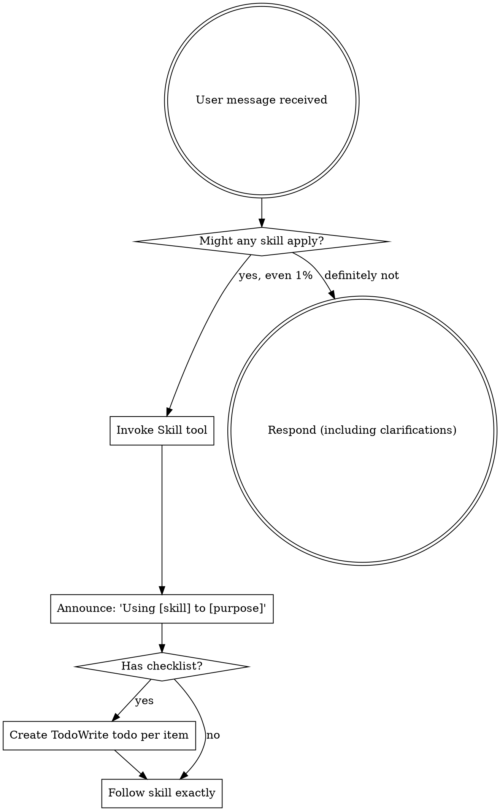

# Workflows Consolidated Skills

## 📋 Table of Contents

- [Address Github Comments](#addressgithubcomments)
- [Code Review Checklist](#codereviewchecklist)
- [Codex Review](#codexreview)
- [Concise Planning](#conciseplanning)
- [Documentation Templates](#documentationtemplates)
- [Github Workflow Automation](#githubworkflowautomation)
- [Plan Writing](#planwriting)
- [Receiving Code Review](#receivingcodereview)
- [Skill Creator 1](#skillcreator1)
- [Tdd Workflow](#tddworkflow)
- [Using Git Worktrees](#usinggitworktrees)
- [Using Superpowers](#usingsuperpowers)
- [Verification Before Completion](#verificationbeforecompletion)
- [Workflow Automation](#workflowautomation)
- [Writing Plans](#writingplans)

---

<a id="addressgithubcomments"></a>

## Address Github Comments

---
name: address-github-comments
description: Use when you need to address review or issue comments on an open GitHub Pull Request using the gh CLI.
---

# Address GitHub Comments

## Overview

Efficiently address PR review comments or issue feedback using the GitHub CLI (`gh`). This skill ensures all feedback is addressed systematically.

## Prerequisites

Ensure `gh` is authenticated.

```bash
gh auth status
```

If not logged in, run `gh auth login`.

## Workflow

### 1. Inspect Comments

Fetch the comments for the current branch's PR.

```bash
gh pr view --comments
```

Or use a custom script if available to list threads.

### 2. Categorize and Plan

- List the comments and review threads.
- Propose a fix for each.
- **Wait for user confirmation** on which comments to address first if there are many.

### 3. Apply Fixes

Apply the code changes for the selected comments.

### 4. Respond to Comments

Once fixed, respond to the threads as resolved.

```bash
gh pr comment <PR_NUMBER> --body "Addressed in latest commit."
```

## Common Mistakes

- **Applying fixes without understanding context**: Always read the surrounding code of a comment.
- **Not verifying auth**: Check `gh auth status` before starting.


---

<a id="codereviewchecklist"></a>

## Code Review Checklist

---
name: code-review-checklist
description: "Comprehensive checklist for conducting thorough code reviews covering functionality, security, performance, and maintainability"
---

# Code Review Checklist

## Overview

Provide a systematic checklist for conducting thorough code reviews. This skill helps reviewers ensure code quality, catch bugs, identify security issues, and maintain consistency across the codebase.

## When to Use This Skill

- Use when reviewing pull requests
- Use when conducting code audits
- Use when establishing code review standards for a team
- Use when training new developers on code review practices
- Use when you want to ensure nothing is missed in reviews
- Use when creating code review documentation

## How It Works

### Step 1: Understand the Context

Before reviewing code, I'll help you understand:
- What problem does this code solve?
- What are the requirements?
- What files were changed and why?
- Are there related issues or tickets?
- What's the testing strategy?

### Step 2: Review Functionality

Check if the code works correctly:
- Does it solve the stated problem?
- Are edge cases handled?
- Is error handling appropriate?
- Are there any logical errors?
- Does it match the requirements?

### Step 3: Review Code Quality

Assess code maintainability:
- Is the code readable and clear?
- Are names descriptive?
- Is it properly structured?
- Are functions/methods focused?
- Is there unnecessary complexity?

### Step 4: Review Security

Check for security issues:
- Are inputs validated?
- Is sensitive data protected?
- Are there SQL injection risks?
- Is authentication/authorization correct?
- Are dependencies secure?

### Step 5: Review Performance

Look for performance issues:
- Are there unnecessary loops?
- Is database access optimized?
- Are there memory leaks?
- Is caching used appropriately?
- Are there N+1 query problems?

### Step 6: Review Tests

Verify test coverage:
- Are there tests for new code?
- Do tests cover edge cases?
- Are tests meaningful?
- Do all tests pass?
- Is test coverage adequate?

## Examples

### Example 1: Functionality Review Checklist

```markdown
## Functionality Review

### Requirements
- [ ] Code solves the stated problem
- [ ] All acceptance criteria are met
- [ ] Edge cases are handled
- [ ] Error cases are handled
- [ ] User input is validated

### Logic
- [ ] No logical errors or bugs
- [ ] Conditions are correct (no off-by-one errors)
- [ ] Loops terminate correctly
- [ ] Recursion has proper base cases
- [ ] State management is correct

### Error Handling
- [ ] Errors are caught appropriately
- [ ] Error messages are clear and helpful
- [ ] Errors don't expose sensitive information
- [ ] Failed operations are rolled back
- [ ] Logging is appropriate

### Example Issues to Catch:

**❌ Bad - Missing validation:**
\`\`\`javascript
function createUser(email, password) {
  // No validation!
  return db.users.create({ email, password });
}
\`\`\`

**✅ Good - Proper validation:**
\`\`\`javascript
function createUser(email, password) {
  if (!email || !isValidEmail(email)) {
    throw new Error('Invalid email address');
  }
  if (!password || password.length < 8) {
    throw new Error('Password must be at least 8 characters');
  }
  return db.users.create({ email, password });
}
\`\`\`
```

### Example 2: Security Review Checklist

```markdown
## Security Review

### Input Validation
- [ ] All user inputs are validated
- [ ] SQL injection is prevented (use parameterized queries)
- [ ] XSS is prevented (escape output)
- [ ] CSRF protection is in place
- [ ] File uploads are validated (type, size, content)

### Authentication & Authorization
- [ ] Authentication is required where needed
- [ ] Authorization checks are present
- [ ] Passwords are hashed (never stored plain text)
- [ ] Sessions are managed securely
- [ ] Tokens expire appropriately

### Data Protection
- [ ] Sensitive data is encrypted
- [ ] API keys are not hardcoded
- [ ] Environment variables are used for secrets
- [ ] Personal data follows privacy regulations
- [ ] Database credentials are secure

### Dependencies
- [ ] No known vulnerable dependencies
- [ ] Dependencies are up to date
- [ ] Unnecessary dependencies are removed
- [ ] Dependency versions are pinned

### Example Issues to Catch:

**❌ Bad - SQL injection risk:**
\`\`\`javascript
const query = \`SELECT * FROM users WHERE email = '\${email}'\`;
db.query(query);
\`\`\`

**✅ Good - Parameterized query:**
\`\`\`javascript
const query = 'SELECT * FROM users WHERE email = $1';
db.query(query, [email]);
\`\`\`

**❌ Bad - Hardcoded secret:**
\`\`\`javascript
const API_KEY = 'sk_live_abc123xyz';
\`\`\`

**✅ Good - Environment variable:**
\`\`\`javascript
const API_KEY = process.env.API_KEY;
if (!API_KEY) {
  throw new Error('API_KEY environment variable is required');
}
\`\`\`
```

### Example 3: Code Quality Review Checklist

```markdown
## Code Quality Review

### Readability
- [ ] Code is easy to understand
- [ ] Variable names are descriptive
- [ ] Function names explain what they do
- [ ] Complex logic has comments
- [ ] Magic numbers are replaced with constants

### Structure
- [ ] Functions are small and focused
- [ ] Code follows DRY principle (Don't Repeat Yourself)
- [ ] Proper separation of concerns
- [ ] Consistent code style
- [ ] No dead code or commented-out code

### Maintainability
- [ ] Code is modular and reusable
- [ ] Dependencies are minimal
- [ ] Changes are backwards compatible
- [ ] Breaking changes are documented
- [ ] Technical debt is noted

### Example Issues to Catch:

**❌ Bad - Unclear naming:**
\`\`\`javascript
function calc(a, b, c) {
  return a * b + c;
}
\`\`\`

**✅ Good - Descriptive naming:**
\`\`\`javascript
function calculateTotalPrice(quantity, unitPrice, tax) {
  return quantity * unitPrice + tax;
}
\`\`\`

**❌ Bad - Function doing too much:**
\`\`\`javascript
function processOrder(order) {
  // Validate order
  if (!order.items) throw new Error('No items');

  // Calculate total
  let total = 0;
  for (let item of order.items) {
    total += item.price * item.quantity;
  }

  // Apply discount
  if (order.coupon) {
    total *= 0.9;
  }

  // Process payment
  const payment = stripe.charge(total);

  // Send email
  sendEmail(order.email, 'Order confirmed');

  // Update inventory
  updateInventory(order.items);

  return { orderId: order.id, total };
}
\`\`\`

**✅ Good - Separated concerns:**
\`\`\`javascript
function processOrder(order) {
  validateOrder(order);
  const total = calculateOrderTotal(order);
  const payment = processPayment(total);
  sendOrderConfirmation(order.email);
  updateInventory(order.items);

  return { orderId: order.id, total };
}
\`\`\`
```

## Best Practices

### ✅ Do This

- **Review Small Changes** - Smaller PRs are easier to review thoroughly
- **Check Tests First** - Verify tests pass and cover new code
- **Run the Code** - Test it locally when possible
- **Ask Questions** - Don't assume, ask for clarification
- **Be Constructive** - Suggest improvements, don't just criticize
- **Focus on Important Issues** - Don't nitpick minor style issues
- **Use Automated Tools** - Linters, formatters, security scanners
- **Review Documentation** - Check if docs are updated
- **Consider Performance** - Think about scale and efficiency
- **Check for Regressions** - Ensure existing functionality still works

### ❌ Don't Do This

- **Don't Approve Without Reading** - Actually review the code
- **Don't Be Vague** - Provide specific feedback with examples
- **Don't Ignore Security** - Security issues are critical
- **Don't Skip Tests** - Untested code will cause problems
- **Don't Be Rude** - Be respectful and professional
- **Don't Rubber Stamp** - Every review should add value
- **Don't Review When Tired** - You'll miss important issues
- **Don't Forget Context** - Understand the bigger picture

## Complete Review Checklist

### Pre-Review
- [ ] Read the PR description and linked issues
- [ ] Understand what problem is being solved
- [ ] Check if tests pass in CI/CD
- [ ] Pull the branch and run it locally

### Functionality
- [ ] Code solves the stated problem
- [ ] Edge cases are handled
- [ ] Error handling is appropriate
- [ ] User input is validated
- [ ] No logical errors

### Security
- [ ] No SQL injection vulnerabilities
- [ ] No XSS vulnerabilities
- [ ] Authentication/authorization is correct
- [ ] Sensitive data is protected
- [ ] No hardcoded secrets

### Performance
- [ ] No unnecessary database queries
- [ ] No N+1 query problems
- [ ] Efficient algorithms used
- [ ] No memory leaks
- [ ] Caching used appropriately

### Code Quality
- [ ] Code is readable and clear
- [ ] Names are descriptive
- [ ] Functions are focused and small
- [ ] No code duplication
- [ ] Follows project conventions

### Tests
- [ ] New code has tests
- [ ] Tests cover edge cases
- [ ] Tests are meaningful
- [ ] All tests pass
- [ ] Test coverage is adequate

### Documentation
- [ ] Code comments explain why, not what
- [ ] API documentation is updated
- [ ] README is updated if needed
- [ ] Breaking changes are documented
- [ ] Migration guide provided if needed

### Git
- [ ] Commit messages are clear
- [ ] No merge conflicts
- [ ] Branch is up to date with main
- [ ] No unnecessary files committed
- [ ] .gitignore is properly configured

## Common Pitfalls

### Problem: Missing Edge Cases
**Symptoms:** Code works for happy path but fails on edge cases
**Solution:** Ask "What if...?" questions
- What if the input is null?
- What if the array is empty?
- What if the user is not authenticated?
- What if the network request fails?

### Problem: Security Vulnerabilities
**Symptoms:** Code exposes security risks
**Solution:** Use security checklist
- Run security scanners (npm audit, Snyk)
- Check OWASP Top 10
- Validate all inputs
- Use parameterized queries
- Never trust user input

### Problem: Poor Test Coverage
**Symptoms:** New code has no tests or inadequate tests
**Solution:** Require tests for all new code
- Unit tests for functions
- Integration tests for features
- Edge case tests
- Error case tests

### Problem: Unclear Code
**Symptoms:** Reviewer can't understand what code does
**Solution:** Request improvements
- Better variable names
- Explanatory comments
- Smaller functions
- Clear structure

## Review Comment Templates

### Requesting Changes
```markdown
**Issue:** [Describe the problem]

**Current code:**
\`\`\`javascript
// Show problematic code
\`\`\`

**Suggested fix:**
\`\`\`javascript
// Show improved code
\`\`\`

**Why:** [Explain why this is better]
```

### Asking Questions
```markdown
**Question:** [Your question]

**Context:** [Why you're asking]

**Suggestion:** [If you have one]
```

### Praising Good Code
```markdown
**Nice!** [What you liked]

This is great because [explain why]
```

## Related Skills

- `@requesting-code-review` - Prepare code for review
- `@receiving-code-review` - Handle review feedback
- `@systematic-debugging` - Debug issues found in review
- `@test-driven-development` - Ensure code has tests

## Additional Resources

- [Google Code Review Guidelines](https://google.github.io/eng-practices/review/)
- [OWASP Top 10](https://owasp.org/www-project-top-ten/)
- [Code Review Best Practices](https://github.com/thoughtbot/guides/tree/main/code-review)
- [How to Review Code](https://www.kevinlondon.com/2015/05/05/code-review-best-practices.html)

---

**Pro Tip:** Use a checklist template for every review to ensure consistency and thoroughness. Customize it for your team's specific needs!


---

<a id="codexreview"></a>

## Codex Review

---
name: codex-review
description: Professional code review with auto CHANGELOG generation, integrated with Codex AI
---

# codex-review

## Overview
Professional code review with auto CHANGELOG generation, integrated with Codex AI

## When to Use
- When you want professional code review before commits
- When you need automatic CHANGELOG generation
- When reviewing large-scale refactoring

## Installation
```bash
npx skills add -g BenedictKing/codex-review
```

## Step-by-Step Guide
1. Install the skill using the command above
2. Ensure Codex CLI is installed
3. Use `/codex-review` or natural language triggers

## Examples
See [GitHub Repository](https://github.com/BenedictKing/codex-review) for examples.

## Best Practices
- Keep CHANGELOG.md in your project root
- Use conventional commit messages

## Troubleshooting
See the GitHub repository for troubleshooting guides.

## Related Skills
- context7-auto-research, tavily-web, exa-search, firecrawl-scraper


---

<a id="conciseplanning"></a>

## Concise Planning

---
name: concise-planning
description: Use when a user asks for a plan for a coding task, to generate a clear, actionable, and atomic checklist.
---

# Concise Planning

## Goal

Turn a user request into a **single, actionable plan** with atomic steps.

## Workflow

### 1. Scan Context

- Read `README.md`, docs, and relevant code files.
- Identify constraints (language, frameworks, tests).

### 2. Minimal Interaction

- Ask **at most 1–2 questions** and only if truly blocking.
- Make reasonable assumptions for non-blocking unknowns.

### 3. Generate Plan

Use the following structure:

- **Approach**: 1-3 sentences on what and why.
- **Scope**: Bullet points for "In" and "Out".
- **Action Items**: A list of 6-10 atomic, ordered tasks (Verb-first).
- **Validation**: At least one item for testing.

## Plan Template

```markdown
# Plan

<High-level approach>

## Scope

- In:
- Out:

## Action Items

[ ] <Step 1: Discovery>
[ ] <Step 2: Implementation>
[ ] <Step 3: Implementation>
[ ] <Step 4: Validation/Testing>
[ ] <Step 5: Rollout/Commit>

## Open Questions

- <Question 1 (max 3)>
```

## Checklist Guidelines

- **Atomic**: Each step should be a single logical unit of work.
- **Verb-first**: "Add...", "Refactor...", "Verify...".
- **Concrete**: Name specific files or modules when possible.


---

<a id="documentationtemplates"></a>

## Documentation Templates

---
name: documentation-templates
description: Documentation templates and structure guidelines. README, API docs, code comments, and AI-friendly documentation.
allowed-tools: Read, Glob, Grep
---

# Documentation Templates

> Templates and structure guidelines for common documentation types.

---

## 1. README Structure

### Essential Sections (Priority Order)

| Section | Purpose |
|---------|---------|
| **Title + One-liner** | What is this? |
| **Quick Start** | Running in <5 min |
| **Features** | What can I do? |
| **Configuration** | How to customize |
| **API Reference** | Link to detailed docs |
| **Contributing** | How to help |
| **License** | Legal |

### README Template

```markdown
# Project Name

Brief one-line description.

## Quick Start

[Minimum steps to run]

## Features

- Feature 1
- Feature 2

## Configuration

| Variable | Description | Default |
|----------|-------------|---------|
| PORT | Server port | 3000 |

## Documentation

- [API Reference](./docs/api.md)
- [Architecture](./docs/architecture.md)

## License

MIT
```

---

## 2. API Documentation Structure

### Per-Endpoint Template

```markdown
## GET /users/:id

Get a user by ID.

**Parameters:**
| Name | Type | Required | Description |
|------|------|----------|-------------|
| id | string | Yes | User ID |

**Response:**
- 200: User object
- 404: User not found

**Example:**
[Request and response example]
```

---

## 3. Code Comment Guidelines

### JSDoc/TSDoc Template

```typescript
/**
 * Brief description of what the function does.
 *
 * @param paramName - Description of parameter
 * @returns Description of return value
 * @throws ErrorType - When this error occurs
 *
 * @example
 * const result = functionName(input);
 */
```

### When to Comment

| ✅ Comment | ❌ Don't Comment |
|-----------|-----------------|
| Why (business logic) | What (obvious) |
| Complex algorithms | Every line |
| Non-obvious behavior | Self-explanatory code |
| API contracts | Implementation details |
| Bug fixes (linked to issue) | **Visual separators (`/====`, `// ----`)** |

### 🎨 Rule of Minimalism
- **NO DECORATIVE COMMENTS:** Absolute ban on verbose separators like `/======== -------` or `// ##########`.
- **Minimalist Gaps:** Use single blank lines for logical separation instead of comment bars.
- **Self-Documenting Code:** If you need a giant comment, refactor the code to be clearer instead.

### 🔐 Multi-Account Git Setup (Super-System)
To manage multiple GitHub accounts (Work vs Personal) without mixing identities:

1. **Host-Based SSH Config:** Edit `~/.ssh/config`
   ```ssh
   # Personal Account
   Host github.com-personal
       HostName github.com
       User git
       IdentityFile ~/.ssh/id_rsa_personal

   # Work Account
   Host github.com-work
       HostName github.com
       User git
       IdentityFile ~/.ssh/id_rsa_work
   ```
2. **Local Repository Config:**
   ```bash
   # Set correctly in each local repo
   git config user.name "Your Name"
   git config user.email "account@email.com"
   ```
3. **Cloning with Alias:** Use the alias Host defined in SSH config.
   ```bash
   git clone git@github.com-work:user/repo.git
   ```

---

## 4. Changelog Template (Keep a Changelog)

```markdown
# Changelog

## [Unreleased]
### Added
- New feature

## [1.0.0] - 2025-01-01
### Added
- Initial release
### Changed
- Updated dependency
### Fixed
- Bug fix
```

---

## 5. Architecture Decision Record (ADR)

```markdown
# ADR-001: [Title]

## Status
Accepted / Deprecated / Superseded

## Context
Why are we making this decision?

## Decision
What did we decide?

## Consequences
What are the trade-offs?
```

---

## 6. AI-Friendly Documentation (2025)

### llms.txt Template

For AI crawlers and agents:

```markdown
# Project Name
> One-line objective.

## Core Files
- [src/index.ts]: Main entry
- [src/api/]: API routes
- [docs/]: Documentation

## Key Concepts
- Concept 1: Brief explanation
- Concept 2: Brief explanation
```

### MCP-Ready Documentation

For RAG indexing:
- Clear H1-H3 hierarchy
- JSON/YAML examples for data structures
- Mermaid diagrams for flows
- Self-contained sections

---

## 7. Structure Principles

| Principle | Why |
|-----------|-----|
| **Scannable** | Headers, lists, tables |
| **Examples first** | Show, don't just tell |
| **Progressive detail** | Simple → Complex |
| **Up to date** | Outdated = misleading |

---

> **Remember:** Templates are starting points. Adapt to your project's needs.


---

<a id="githubworkflowautomation"></a>

## Github Workflow Automation

---
name: github-workflow-automation
description: "Automate GitHub workflows with AI assistance. Includes PR reviews, issue triage, CI/CD integration, and Git operations. Use when automating GitHub workflows, setting up PR review automation, creating GitHub Actions, or triaging issues."
---

# 🔧 GitHub Workflow Automation

> Patterns for automating GitHub workflows with AI assistance, inspired by [Gemini CLI](https://github.com/google-gemini/gemini-cli) and modern DevOps practices.

## When to Use This Skill

Use this skill when:

- Automating PR reviews with AI
- Setting up issue triage automation
- Creating GitHub Actions workflows
- Integrating AI into CI/CD pipelines
- Automating Git operations (rebases, cherry-picks)

---

## 1. Automated PR Review

### 1.1 PR Review Action

```yaml
# .github/workflows/ai-review.yml
name: AI Code Review

on:
  pull_request:
    types: [opened, synchronize]

jobs:
  review:
    runs-on: ubuntu-latest
    permissions:
      contents: read
      pull-requests: write

    steps:
      - uses: actions/checkout@v4
        with:
          fetch-depth: 0

      - name: Get changed files
        id: changed
        run: |
          files=$(git diff --name-only origin/${{ github.base_ref }}...HEAD)
          echo "files<<EOF" >> $GITHUB_OUTPUT
          echo "$files" >> $GITHUB_OUTPUT
          echo "EOF" >> $GITHUB_OUTPUT

      - name: Get diff
        id: diff
        run: |
          diff=$(git diff origin/${{ github.base_ref }}...HEAD)
          echo "diff<<EOF" >> $GITHUB_OUTPUT
          echo "$diff" >> $GITHUB_OUTPUT
          echo "EOF" >> $GITHUB_OUTPUT

      - name: AI Review
        uses: actions/github-script@v7
        with:
          script: |
            const { Anthropic } = require('@anthropic-ai/sdk');
            const client = new Anthropic({ apiKey: process.env.ANTHROPIC_API_KEY });

            const response = await client.messages.create({
              model: "claude-3-sonnet-20240229",
              max_tokens: 4096,
              messages: [{
                role: "user",
                content: `Review this PR diff and provide feedback:

                Changed files: ${{ steps.changed.outputs.files }}

                Diff:
                ${{ steps.diff.outputs.diff }}

                Provide:
                1. Summary of changes
                2. Potential issues or bugs
                3. Suggestions for improvement
                4. Security concerns if any

                Format as GitHub markdown.`
              }]
            });

            await github.rest.pulls.createReview({
              owner: context.repo.owner,
              repo: context.repo.repo,
              pull_number: context.issue.number,
              body: response.content[0].text,
              event: 'COMMENT'
            });
        env:
          ANTHROPIC_API_KEY: ${{ secrets.ANTHROPIC_API_KEY }}
```

### 1.2 Review Comment Patterns

````markdown
# AI Review Structure

## 📋 Summary

Brief description of what this PR does.

## ✅ What looks good

- Well-structured code
- Good test coverage
- Clear naming conventions

## ⚠️ Potential Issues

1. **Line 42**: Possible null pointer exception
   ```javascript
   // Current
   user.profile.name;
   // Suggested
   user?.profile?.name ?? "Unknown";
   ```
````

2. **Line 78**: Consider error handling
   ```javascript
   // Add try-catch or .catch()
   ```

## 💡 Suggestions

- Consider extracting the validation logic into a separate function
- Add JSDoc comments for public methods

## 🔒 Security Notes

- No sensitive data exposure detected
- API key handling looks correct

````

### 1.3 Focused Reviews

```yaml
# Review only specific file types
- name: Filter code files
  run: |
    files=$(git diff --name-only origin/${{ github.base_ref }}...HEAD | \
            grep -E '\.(ts|tsx|js|jsx|py|go)$' || true)
    echo "code_files=$files" >> $GITHUB_OUTPUT

# Review with context
- name: AI Review with context
  run: |
    # Include relevant context files
    context=""
    for file in ${{ steps.changed.outputs.files }}; do
      if [[ -f "$file" ]]; then
        context+="=== $file ===\n$(cat $file)\n\n"
      fi
    done

    # Send to AI with full file context
````

---

## 2. Issue Triage Automation

### 2.1 Auto-label Issues

```yaml
# .github/workflows/issue-triage.yml
name: Issue Triage

on:
  issues:
    types: [opened]

jobs:
  triage:
    runs-on: ubuntu-latest
    permissions:
      issues: write

    steps:
      - name: Analyze issue
        uses: actions/github-script@v7
        with:
          script: |
            const issue = context.payload.issue;

            // Call AI to analyze
            const analysis = await analyzeIssue(issue.title, issue.body);

            // Apply labels
            const labels = [];

            if (analysis.type === 'bug') {
              labels.push('bug');
              if (analysis.severity === 'high') labels.push('priority: high');
            } else if (analysis.type === 'feature') {
              labels.push('enhancement');
            } else if (analysis.type === 'question') {
              labels.push('question');
            }

            if (analysis.area) {
              labels.push(`area: ${analysis.area}`);
            }

            await github.rest.issues.addLabels({
              owner: context.repo.owner,
              repo: context.repo.repo,
              issue_number: issue.number,
              labels: labels
            });

            // Add initial response
            if (analysis.type === 'bug' && !analysis.hasReproSteps) {
              await github.rest.issues.createComment({
                owner: context.repo.owner,
                repo: context.repo.repo,
                issue_number: issue.number,
                body: `Thanks for reporting this issue!

To help us investigate, could you please provide:
- Steps to reproduce the issue
- Expected behavior
- Actual behavior
- Environment (OS, version, etc.)

This will help us resolve your issue faster. 🙏`
              });
            }
```

### 2.2 Issue Analysis Prompt

```typescript
const TRIAGE_PROMPT = `
Analyze this GitHub issue and classify it:

Title: {title}
Body: {body}

Return JSON with:
{
  "type": "bug" | "feature" | "question" | "docs" | "other",
  "severity": "low" | "medium" | "high" | "critical",
  "area": "frontend" | "backend" | "api" | "docs" | "ci" | "other",
  "summary": "one-line summary",
  "hasReproSteps": boolean,
  "isFirstContribution": boolean,
  "suggestedLabels": ["label1", "label2"],
  "suggestedAssignees": ["username"] // based on area expertise
}
`;
```

### 2.3 Stale Issue Management

```yaml
# .github/workflows/stale.yml
name: Manage Stale Issues

on:
  schedule:
    - cron: "0 0 * * *" # Daily

jobs:
  stale:
    runs-on: ubuntu-latest
    steps:
      - uses: actions/stale@v9
        with:
          stale-issue-message: |
            This issue has been automatically marked as stale because it has not had
            recent activity. It will be closed in 14 days if no further activity occurs.

            If this issue is still relevant:
            - Add a comment with an update
            - Remove the `stale` label

            Thank you for your contributions! 🙏

          stale-pr-message: |
            This PR has been automatically marked as stale. Please update it or it
            will be closed in 14 days.

          days-before-stale: 60
          days-before-close: 14
          stale-issue-label: "stale"
          stale-pr-label: "stale"
          exempt-issue-labels: "pinned,security,in-progress"
          exempt-pr-labels: "pinned,security"
```

---

## 3. CI/CD Integration

### 3.1 Smart Test Selection

```yaml
# .github/workflows/smart-tests.yml
name: Smart Test Selection

on:
  pull_request:

jobs:
  analyze:
    runs-on: ubuntu-latest
    outputs:
      test_suites: ${{ steps.analyze.outputs.suites }}

    steps:
      - uses: actions/checkout@v4
        with:
          fetch-depth: 0

      - name: Analyze changes
        id: analyze
        run: |
          # Get changed files
          changed=$(git diff --name-only origin/${{ github.base_ref }}...HEAD)

          # Determine which test suites to run
          suites="[]"

          if echo "$changed" | grep -q "^src/api/"; then
            suites=$(echo $suites | jq '. + ["api"]')
          fi

          if echo "$changed" | grep -q "^src/frontend/"; then
            suites=$(echo $suites | jq '. + ["frontend"]')
          fi

          if echo "$changed" | grep -q "^src/database/"; then
            suites=$(echo $suites | jq '. + ["database", "api"]')
          fi

          # If nothing specific, run all
          if [ "$suites" = "[]" ]; then
            suites='["all"]'
          fi

          echo "suites=$suites" >> $GITHUB_OUTPUT

  test:
    needs: analyze
    runs-on: ubuntu-latest
    strategy:
      matrix:
        suite: ${{ fromJson(needs.analyze.outputs.test_suites) }}

    steps:
      - uses: actions/checkout@v4

      - name: Run tests
        run: |
          if [ "${{ matrix.suite }}" = "all" ]; then
            npm test
          else
            npm test -- --suite ${{ matrix.suite }}
          fi
```

### 3.2 Deployment with AI Validation

```yaml
# .github/workflows/deploy.yml
name: Deploy with AI Validation

on:
  push:
    branches: [main]

jobs:
  validate:
    runs-on: ubuntu-latest
    steps:
      - uses: actions/checkout@v4

      - name: Get deployment changes
        id: changes
        run: |
          # Get commits since last deployment
          last_deploy=$(git describe --tags --abbrev=0 2>/dev/null || echo "")
          if [ -n "$last_deploy" ]; then
            changes=$(git log --oneline $last_deploy..HEAD)
          else
            changes=$(git log --oneline -10)
          fi
          echo "changes<<EOF" >> $GITHUB_OUTPUT
          echo "$changes" >> $GITHUB_OUTPUT
          echo "EOF" >> $GITHUB_OUTPUT

      - name: AI Risk Assessment
        id: assess
        uses: actions/github-script@v7
        with:
          script: |
            // Analyze changes for deployment risk
            const prompt = `
            Analyze these changes for deployment risk:

            ${process.env.CHANGES}

            Return JSON:
            {
              "riskLevel": "low" | "medium" | "high",
              "concerns": ["concern1", "concern2"],
              "recommendations": ["rec1", "rec2"],
              "requiresManualApproval": boolean
            }
            `;

            // Call AI and parse response
            const analysis = await callAI(prompt);

            if (analysis.riskLevel === 'high') {
              core.setFailed('High-risk deployment detected. Manual review required.');
            }

            return analysis;
        env:
          CHANGES: ${{ steps.changes.outputs.changes }}

  deploy:
    needs: validate
    runs-on: ubuntu-latest
    environment: production
    steps:
      - name: Deploy
        run: |
          echo "Deploying to production..."
          # Deployment commands here
```

### 3.3 Rollback Automation

```yaml
# .github/workflows/rollback.yml
name: Automated Rollback

on:
  workflow_dispatch:
    inputs:
      reason:
        description: "Reason for rollback"
        required: true

jobs:
  rollback:
    runs-on: ubuntu-latest
    steps:
      - uses: actions/checkout@v4
        with:
          fetch-depth: 0

      - name: Find last stable version
        id: stable
        run: |
          # Find last successful deployment
          stable=$(git tag -l 'v*' --sort=-version:refname | head -1)
          echo "version=$stable" >> $GITHUB_OUTPUT

      - name: Rollback
        run: |
          git checkout ${{ steps.stable.outputs.version }}
          # Deploy stable version
          npm run deploy

      - name: Notify team
        uses: slackapi/slack-github-action@v1
        with:
          payload: |
            {
              "text": "🔄 Production rolled back to ${{ steps.stable.outputs.version }}",
              "blocks": [
                {
                  "type": "section",
                  "text": {
                    "type": "mrkdwn",
                    "text": "*Rollback executed*\n• Version: `${{ steps.stable.outputs.version }}`\n• Reason: ${{ inputs.reason }}\n• Triggered by: ${{ github.actor }}"
                  }
                }
              ]
            }
```

---

## 4. Git Operations

### 4.1 Automated Rebasing

```yaml
# .github/workflows/auto-rebase.yml
name: Auto Rebase

on:
  issue_comment:
    types: [created]

jobs:
  rebase:
    if: github.event.issue.pull_request && contains(github.event.comment.body, '/rebase')
    runs-on: ubuntu-latest

    steps:
      - uses: actions/checkout@v4
        with:
          fetch-depth: 0
          token: ${{ secrets.GITHUB_TOKEN }}

      - name: Setup Git
        run: |
          git config user.name "github-actions[bot]"
          git config user.email "github-actions[bot]@users.noreply.github.com"

      - name: Rebase PR
        run: |
          # Fetch PR branch
          gh pr checkout ${{ github.event.issue.number }}

          # Rebase onto main
          git fetch origin main
          git rebase origin/main

          # Force push
          git push --force-with-lease
        env:
          GH_TOKEN: ${{ secrets.GITHUB_TOKEN }}

      - name: Comment result
        uses: actions/github-script@v7
        with:
          script: |
            github.rest.issues.createComment({
              owner: context.repo.owner,
              repo: context.repo.repo,
              issue_number: context.issue.number,
              body: '✅ Successfully rebased onto main!'
            })
```

### 4.2 Smart Cherry-Pick

```typescript
// AI-assisted cherry-pick that handles conflicts
async function smartCherryPick(commitHash: string, targetBranch: string) {
  // Get commit info
  const commitInfo = await exec(`git show ${commitHash} --stat`);

  // Check for potential conflicts
  const targetDiff = await exec(
    `git diff ${targetBranch}...HEAD -- ${affectedFiles}`
  );

  // AI analysis
  const analysis = await ai.analyze(`
    I need to cherry-pick this commit to ${targetBranch}:

    ${commitInfo}

    Current state of affected files on ${targetBranch}:
    ${targetDiff}

    Will there be conflicts? If so, suggest resolution strategy.
  `);

  if (analysis.willConflict) {
    // Create branch for manual resolution
    await exec(
      `git checkout -b cherry-pick-${commitHash.slice(0, 7)} ${targetBranch}`
    );
    const result = await exec(`git cherry-pick ${commitHash}`, {
      allowFail: true,
    });

    if (result.failed) {
      // AI-assisted conflict resolution
      const conflicts = await getConflicts();
      for (const conflict of conflicts) {
        const resolution = await ai.resolveConflict(conflict);
        await applyResolution(conflict.file, resolution);
      }
    }
  } else {
    await exec(`git checkout ${targetBranch}`);
    await exec(`git cherry-pick ${commitHash}`);
  }
}
```

### 4.3 Branch Cleanup

```yaml
# .github/workflows/branch-cleanup.yml
name: Branch Cleanup

on:
  schedule:
    - cron: '0 0 * * 0'  # Weekly
  workflow_dispatch:

jobs:
  cleanup:
    runs-on: ubuntu-latest
    steps:
      - uses: actions/checkout@v4
        with:
          fetch-depth: 0

      - name: Find stale branches
        id: stale
        run: |
          # Branches not updated in 30 days
          stale=$(git for-each-ref --sort=-committerdate refs/remotes/origin \
            --format='%(refname:short) %(committerdate:relative)' | \
            grep -E '[3-9][0-9]+ days|[0-9]+ months|[0-9]+ years' | \
            grep -v 'origin/main\|origin/develop' | \
            cut -d' ' -f1 | sed 's|origin/||')

          echo "branches<<EOF" >> $GITHUB_OUTPUT
          echo "$stale" >> $GITHUB_OUTPUT
          echo "EOF" >> $GITHUB_OUTPUT

      - name: Create cleanup PR
        if: steps.stale.outputs.branches != ''
        uses: actions/github-script@v7
        with:
          script: |
            const branches = `${{ steps.stale.outputs.branches }}`.split('\n').filter(Boolean);

            const body = `## 🧹 Stale Branch Cleanup

The following branches haven't been updated in over 30 days:

${branches.map(b => `- \`${b}\``).join('\n')}

### Actions:
- [ ] Review each branch
- [ ] Delete branches that are no longer needed
- Comment \`/keep branch-name\` to preserve specific branches
`;

            await github.rest.issues.create({
              owner: context.repo.owner,
              repo: context.repo.repo,
              title: 'Stale Branch Cleanup',
              body: body,
              labels: ['housekeeping']
            });
```

---

## 5. On-Demand Assistance

### 5.1 @mention Bot

```yaml
# .github/workflows/mention-bot.yml
name: AI Mention Bot

on:
  issue_comment:
    types: [created]
  pull_request_review_comment:
    types: [created]

jobs:
  respond:
    if: contains(github.event.comment.body, '@ai-helper')
    runs-on: ubuntu-latest

    steps:
      - uses: actions/checkout@v4

      - name: Extract question
        id: question
        run: |
          # Extract text after @ai-helper
          question=$(echo "${{ github.event.comment.body }}" | sed 's/.*@ai-helper//')
          echo "question=$question" >> $GITHUB_OUTPUT

      - name: Get context
        id: context
        run: |
          if [ "${{ github.event.issue.pull_request }}" != "" ]; then
            # It's a PR - get diff
            gh pr diff ${{ github.event.issue.number }} > context.txt
          else
            # It's an issue - get description
            gh issue view ${{ github.event.issue.number }} --json body -q .body > context.txt
          fi
          echo "context=$(cat context.txt)" >> $GITHUB_OUTPUT
        env:
          GH_TOKEN: ${{ secrets.GITHUB_TOKEN }}

      - name: AI Response
        uses: actions/github-script@v7
        with:
          script: |
            const response = await ai.chat(`
              Context: ${process.env.CONTEXT}

              Question: ${process.env.QUESTION}

              Provide a helpful, specific answer. Include code examples if relevant.
            `);

            await github.rest.issues.createComment({
              owner: context.repo.owner,
              repo: context.repo.repo,
              issue_number: context.issue.number,
              body: response
            });
        env:
          CONTEXT: ${{ steps.context.outputs.context }}
          QUESTION: ${{ steps.question.outputs.question }}
```

### 5.2 Command Patterns

```markdown
## Available Commands

| Command              | Description                 |
| :------------------- | :-------------------------- |
| `@ai-helper explain` | Explain the code in this PR |
| `@ai-helper review`  | Request AI code review      |
| `@ai-helper fix`     | Suggest fixes for issues    |
| `@ai-helper test`    | Generate test cases         |
| `@ai-helper docs`    | Generate documentation      |
| `/rebase`            | Rebase PR onto main         |
| `/update`            | Update PR branch from main  |
| `/approve`           | Mark as approved by bot     |
| `/label bug`         | Add 'bug' label             |
| `/assign @user`      | Assign to user              |
```

---

## 6. Repository Configuration

### 6.1 CODEOWNERS

```
# .github/CODEOWNERS

# Global owners
* @org/core-team

# Frontend
/src/frontend/ @org/frontend-team
*.tsx @org/frontend-team
*.css @org/frontend-team

# Backend
/src/api/ @org/backend-team
/src/database/ @org/backend-team

# Infrastructure
/.github/ @org/devops-team
/terraform/ @org/devops-team
Dockerfile @org/devops-team

# Docs
/docs/ @org/docs-team
*.md @org/docs-team

# Security-sensitive
/src/auth/ @org/security-team
/src/crypto/ @org/security-team
```

### 6.2 Branch Protection

```yaml
# Set up via GitHub API
- name: Configure branch protection
  uses: actions/github-script@v7
  with:
    script: |
      await github.rest.repos.updateBranchProtection({
        owner: context.repo.owner,
        repo: context.repo.repo,
        branch: 'main',
        required_status_checks: {
          strict: true,
          contexts: ['test', 'lint', 'ai-review']
        },
        enforce_admins: true,
        required_pull_request_reviews: {
          required_approving_review_count: 1,
          require_code_owner_reviews: true,
          dismiss_stale_reviews: true
        },
        restrictions: null,
        required_linear_history: true,
        allow_force_pushes: false,
        allow_deletions: false
      });
```

---

## Best Practices

### Security

- [ ] Store API keys in GitHub Secrets
- [ ] Use minimal permissions in workflows
- [ ] Validate all inputs
- [ ] Don't expose sensitive data in logs

### Performance

- [ ] Cache dependencies
- [ ] Use matrix builds for parallel testing
- [ ] Skip unnecessary jobs with path filters
- [ ] Use self-hosted runners for heavy workloads

### Reliability

- [ ] Add timeouts to jobs
- [ ] Handle rate limits gracefully
- [ ] Implement retry logic
- [ ] Have rollback procedures

---

## Resources

- [Gemini CLI GitHub Action](https://github.com/google-github-actions/run-gemini-cli)
- [GitHub Actions Documentation](https://docs.github.com/en/actions)
- [GitHub REST API](https://docs.github.com/en/rest)
- [CODEOWNERS Syntax](https://docs.github.com/en/repositories/managing-your-repositorys-settings-and-features/customizing-your-repository/about-code-owners)


---

<a id="planwriting"></a>

## Plan Writing

---
name: plan-writing
description: Structured task planning with clear breakdowns, dependencies, and verification criteria. Use when implementing features, refactoring, or any multi-step work.
allowed-tools: Read, Glob, Grep
---

# Plan Writing

> Source: obra/superpowers

## Overview
This skill provides a framework for breaking down work into clear, actionable tasks with verification criteria.

## Task Breakdown Principles

### 1. Small, Focused Tasks
- Each task should take 2-5 minutes
- One clear outcome per task
- Independently verifiable

### 2. Clear Verification
- How do you know it's done?
- What can you check/test?
- What's the expected output?

### 3. Logical Ordering
- Dependencies identified
- Parallel work where possible
- Critical path highlighted
- **Phase X: Verification is always LAST**

### 4. Dynamic Naming in Project Root
- Plan files are saved as `{task-slug}.md` in the PROJECT ROOT
- Name derived from task (e.g., "add auth" → `auth-feature.md`)
- **NEVER** inside `.claude/`, `docs/`, or temp folders

## Planning Principles (NOT Templates!)

> 🔴 **NO fixed templates. Each plan is UNIQUE to the task.**

### Principle 1: Keep It SHORT

| ❌ Wrong | ✅ Right |
|----------|----------|
| 50 tasks with sub-sub-tasks | 5-10 clear tasks max |
| Every micro-step listed | Only actionable items |
| Verbose descriptions | One-line per task |

> **Rule:** If plan is longer than 1 page, it's too long. Simplify.

---

### Principle 2: Be SPECIFIC, Not Generic

| ❌ Wrong | ✅ Right |
|----------|----------|
| "Set up project" | "Run `npx create-next-app`" |
| "Add authentication" | "Install next-auth, create `/api/auth/[...nextauth].ts`" |
| "Style the UI" | "Add Tailwind classes to `Header.tsx`" |

> **Rule:** Each task should have a clear, verifiable outcome.

---

### Principle 3: Dynamic Content Based on Project Type

**For NEW PROJECT:**
- What tech stack? (decide first)
- What's the MVP? (minimal features)
- What's the file structure?

**For FEATURE ADDITION:**
- Which files are affected?
- What dependencies needed?
- How to verify it works?

**For BUG FIX:**
- What's the root cause?
- What file/line to change?
- How to test the fix?

---

### Principle 4: Scripts Are Project-Specific

> 🔴 **DO NOT copy-paste script commands. Choose based on project type.**

| Project Type | Relevant Scripts |
|--------------|------------------|
| Frontend/React | `ux_audit.py`, `accessibility_checker.py` |
| Backend/API | `api_validator.py`, `security_scan.py` |
| Mobile | `mobile_audit.py` |
| Database | `schema_validator.py` |
| Full-stack | Mix of above based on what you touched |

**Wrong:** Adding all scripts to every plan
**Right:** Only scripts relevant to THIS task

---

### Principle 5: Verification is Simple

| ❌ Wrong | ✅ Right |
|----------|----------|
| "Verify the component works correctly" | "Run `npm run dev`, click button, see toast" |
| "Test the API" | "curl localhost:3000/api/users returns 200" |
| "Check styles" | "Open browser, verify dark mode toggle works" |

---

## Plan Structure (Flexible, Not Fixed!)

```
# [Task Name]

## Goal
One sentence: What are we building/fixing?

## Tasks
- [ ] Task 1: [Specific action] → Verify: [How to check]
- [ ] Task 2: [Specific action] → Verify: [How to check]
- [ ] Task 3: [Specific action] → Verify: [How to check]

## Done When
- [ ] [Main success criteria]
```

> **That's it.** No phases, no sub-sections unless truly needed.
> Keep it minimal. Add complexity only when required.

## Notes
[Any important considerations]
```

---

## Best Practices (Quick Reference)

1. **Start with goal** - What are we building/fixing?
2. **Max 10 tasks** - If more, break into multiple plans
3. **Each task verifiable** - Clear "done" criteria
4. **Project-specific** - No copy-paste templates
5. **Update as you go** - Mark `[x]` when complete

---

## When to Use

- New project from scratch
- Adding a feature
- Fixing a bug (if complex)
- Refactoring multiple files


---

<a id="receivingcodereview"></a>

## Receiving Code Review

---
name: receiving-code-review
description: Use when receiving code review feedback, before implementing suggestions, especially if feedback seems unclear or technically questionable - requires technical rigor and verification, not performative agreement or blind implementation
---

# Code Review Reception

## Overview

Code review requires technical evaluation, not emotional performance.

**Core principle:** Verify before implementing. Ask before assuming. Technical correctness over social comfort.

## The Response Pattern

```
WHEN receiving code review feedback:

1. READ: Complete feedback without reacting
2. UNDERSTAND: Restate requirement in own words (or ask)
3. VERIFY: Check against codebase reality
4. EVALUATE: Technically sound for THIS codebase?
5. RESPOND: Technical acknowledgment or reasoned pushback
6. IMPLEMENT: One item at a time, test each
```

## Forbidden Responses

**NEVER:**
- "You're absolutely right!" (explicit CLAUDE.md violation)
- "Great point!" / "Excellent feedback!" (performative)
- "Let me implement that now" (before verification)

**INSTEAD:**
- Restate the technical requirement
- Ask clarifying questions
- Push back with technical reasoning if wrong
- Just start working (actions > words)

## Handling Unclear Feedback

```
IF any item is unclear:
  STOP - do not implement anything yet
  ASK for clarification on unclear items

WHY: Items may be related. Partial understanding = wrong implementation.
```

**Example:**
```
your human partner: "Fix 1-6"
You understand 1,2,3,6. Unclear on 4,5.

❌ WRONG: Implement 1,2,3,6 now, ask about 4,5 later
✅ RIGHT: "I understand items 1,2,3,6. Need clarification on 4 and 5 before proceeding."
```

## Source-Specific Handling

### From your human partner
- **Trusted** - implement after understanding
- **Still ask** if scope unclear
- **No performative agreement**
- **Skip to action** or technical acknowledgment

### From External Reviewers
```
BEFORE implementing:
  1. Check: Technically correct for THIS codebase?
  2. Check: Breaks existing functionality?
  3. Check: Reason for current implementation?
  4. Check: Works on all platforms/versions?
  5. Check: Does reviewer understand full context?

IF suggestion seems wrong:
  Push back with technical reasoning

IF can't easily verify:
  Say so: "I can't verify this without [X]. Should I [investigate/ask/proceed]?"

IF conflicts with your human partner's prior decisions:
  Stop and discuss with your human partner first
```

**your human partner's rule:** "External feedback - be skeptical, but check carefully"

## YAGNI Check for "Professional" Features

```
IF reviewer suggests "implementing properly":
  grep codebase for actual usage

  IF unused: "This endpoint isn't called. Remove it (YAGNI)?"
  IF used: Then implement properly
```

**your human partner's rule:** "You and reviewer both report to me. If we don't need this feature, don't add it."

## Implementation Order

```
FOR multi-item feedback:
  1. Clarify anything unclear FIRST
  2. Then implement in this order:
     - Blocking issues (breaks, security)
     - Simple fixes (typos, imports)
     - Complex fixes (refactoring, logic)
  3. Test each fix individually
  4. Verify no regressions
```

## When To Push Back

Push back when:
- Suggestion breaks existing functionality
- Reviewer lacks full context
- Violates YAGNI (unused feature)
- Technically incorrect for this stack
- Legacy/compatibility reasons exist
- Conflicts with your human partner's architectural decisions

**How to push back:**
- Use technical reasoning, not defensiveness
- Ask specific questions
- Reference working tests/code
- Involve your human partner if architectural

**Signal if uncomfortable pushing back out loud:** "Strange things are afoot at the Circle K"

## Acknowledging Correct Feedback

When feedback IS correct:
```
✅ "Fixed. [Brief description of what changed]"
✅ "Good catch - [specific issue]. Fixed in [location]."
✅ [Just fix it and show in the code]

❌ "You're absolutely right!"
❌ "Great point!"
❌ "Thanks for catching that!"
❌ "Thanks for [anything]"
❌ ANY gratitude expression
```

**Why no thanks:** Actions speak. Just fix it. The code itself shows you heard the feedback.

**If you catch yourself about to write "Thanks":** DELETE IT. State the fix instead.

## Gracefully Correcting Your Pushback

If you pushed back and were wrong:
```
✅ "You were right - I checked [X] and it does [Y]. Implementing now."
✅ "Verified this and you're correct. My initial understanding was wrong because [reason]. Fixing."

❌ Long apology
❌ Defending why you pushed back
❌ Over-explaining
```

State the correction factually and move on.

## Common Mistakes

| Mistake | Fix |
|---------|-----|
| Performative agreement | State requirement or just act |
| Blind implementation | Verify against codebase first |
| Batch without testing | One at a time, test each |
| Assuming reviewer is right | Check if breaks things |
| Avoiding pushback | Technical correctness > comfort |
| Partial implementation | Clarify all items first |
| Can't verify, proceed anyway | State limitation, ask for direction |

## Real Examples

**Performative Agreement (Bad):**
```
Reviewer: "Remove legacy code"
❌ "You're absolutely right! Let me remove that..."
```

**Technical Verification (Good):**
```
Reviewer: "Remove legacy code"
✅ "Checking... build target is 10.15+, this API needs 13+. Need legacy for backward compat. Current impl has wrong bundle ID - fix it or drop pre-13 support?"
```

**YAGNI (Good):**
```
Reviewer: "Implement proper metrics tracking with database, date filters, CSV export"
✅ "Grepped codebase - nothing calls this endpoint. Remove it (YAGNI)? Or is there usage I'm missing?"
```

**Unclear Item (Good):**
```
your human partner: "Fix items 1-6"
You understand 1,2,3,6. Unclear on 4,5.
✅ "Understand 1,2,3,6. Need clarification on 4 and 5 before implementing."
```

## GitHub Thread Replies

When replying to inline review comments on GitHub, reply in the comment thread (`gh api repos/{owner}/{repo}/pulls/{pr}/comments/{id}/replies`), not as a top-level PR comment.

## The Bottom Line

**External feedback = suggestions to evaluate, not orders to follow.**

Verify. Question. Then implement.

No performative agreement. Technical rigor always.


---

<a id="skillcreator1"></a>

## Skill Creator 1

---
name: skill-creator
description: Guide for creating effective skills. This skill should be used when users want to create a new skill (or update an existing skill) that extends Claude's capabilities with specialized knowledge, workflows, or tool integrations.
---

# Skill Creator

This skill provides guidance for creating effective skills.

## About Skills

Skills are modular, self-contained packages that extend Claude's capabilities by providing
specialized knowledge, workflows, and tools. Think of them as "onboarding guides" for specific
domains or tasks—they transform Claude from a general-purpose agent into a specialized agent
equipped with procedural knowledge that no model can fully possess.

### What Skills Provide

1. Specialized workflows - Multi-step procedures for specific domains
2. Tool integrations - Instructions for working with specific file formats or APIs
3. Domain expertise - Company-specific knowledge, schemas, business logic
4. Bundled resources - Scripts, references, and assets for complex and repetitive tasks

## Core Principles

### Concise is Key

The context window is a public good. Skills share the context window with everything else Claude needs: system prompt, conversation history, other Skills' metadata, and the actual user request.

**Default assumption: Claude is already very smart.** Only add context Claude doesn't already have. Challenge each piece of information: "Does Claude really need this explanation?" and "Does this paragraph justify its token cost?"

Prefer concise examples over verbose explanations.

### Set Appropriate Degrees of Freedom

Match the level of specificity to the task's fragility and variability:

**High freedom (text-based instructions)**: Use when multiple approaches are valid, decisions depend on context, or heuristics guide the approach.

**Medium freedom (pseudocode or scripts with parameters)**: Use when a preferred pattern exists, some variation is acceptable, or configuration affects behavior.

**Low freedom (specific scripts, few parameters)**: Use when operations are fragile and error-prone, consistency is critical, or a specific sequence must be followed.

Think of Claude as exploring a path: a narrow bridge with cliffs needs specific guardrails (low freedom), while an open field allows many routes (high freedom).

### Anatomy of a Skill

Every skill consists of a required SKILL.md file and optional bundled resources:

```
skill-name/
├── SKILL.md (required)
│   ├── YAML frontmatter metadata (required)
│   │   ├── name: (required)
│   │   └── description: (required)
│   └── Markdown instructions (required)
└── Bundled Resources (optional)
    ├── scripts/          - Executable code (Python/Bash/etc.)
    ├── references/       - Documentation intended to be loaded into context as needed
    └── assets/           - Files used in output (templates, icons, fonts, etc.)
```

#### SKILL.md (required)

Every SKILL.md consists of:

- **Frontmatter** (YAML): Contains `name` and `description` fields. These are the only fields that Claude reads to determine when the skill gets used, thus it is very important to be clear and comprehensive in describing what the skill is, and when it should be used.
- **Body** (Markdown): Instructions and guidance for using the skill. Only loaded AFTER the skill triggers (if at all).

#### Bundled Resources (optional)

##### Scripts (`scripts/`)

Executable code (Python/Bash/etc.) for tasks that require deterministic reliability or are repeatedly rewritten.

- **When to include**: When the same code is being rewritten repeatedly or deterministic reliability is needed
- **Example**: `scripts/rotate_pdf.py` for PDF rotation tasks
- **Benefits**: Token efficient, deterministic, may be executed without loading into context
- **Note**: Scripts may still need to be read by Claude for patching or environment-specific adjustments

##### References (`references/`)

Documentation and reference material intended to be loaded as needed into context to inform Claude's process and thinking.

- **When to include**: For documentation that Claude should reference while working
- **Examples**: `references/finance.md` for financial schemas, `references/mnda.md` for company NDA template, `references/policies.md` for company policies, `references/api_docs.md` for API specifications
- **Use cases**: Database schemas, API documentation, domain knowledge, company policies, detailed workflow guides
- **Benefits**: Keeps SKILL.md lean, loaded only when Claude determines it's needed
- **Best practice**: If files are large (>10k words), include grep search patterns in SKILL.md
- **Avoid duplication**: Information should live in either SKILL.md or references files, not both. Prefer references files for detailed information unless it's truly core to the skill—this keeps SKILL.md lean while making information discoverable without hogging the context window. Keep only essential procedural instructions and workflow guidance in SKILL.md; move detailed reference material, schemas, and examples to references files.

##### Assets (`assets/`)

Files not intended to be loaded into context, but rather used within the output Claude produces.

- **When to include**: When the skill needs files that will be used in the final output
- **Examples**: `assets/logo.png` for brand assets, `assets/slides.pptx` for PowerPoint templates, `assets/frontend-template/` for HTML/React boilerplate, `assets/font.ttf` for typography
- **Use cases**: Templates, images, icons, boilerplate code, fonts, sample documents that get copied or modified
- **Benefits**: Separates output resources from documentation, enables Claude to use files without loading them into context

#### What to Not Include in a Skill

A skill should only contain essential files that directly support its functionality. Do NOT create extraneous documentation or auxiliary files, including:

- README.md
- INSTALLATION_GUIDE.md
- QUICK_REFERENCE.md
- CHANGELOG.md
- etc.

The skill should only contain the information needed for an AI agent to do the job at hand. It should not contain auxilary context about the process that went into creating it, setup and testing procedures, user-facing documentation, etc. Creating additional documentation files just adds clutter and confusion.

### Progressive Disclosure Design Principle

Skills use a three-level loading system to manage context efficiently:

1. **Metadata (name + description)** - Always in context (~100 words)
2. **SKILL.md body** - When skill triggers (<5k words)
3. **Bundled resources** - As needed by Claude (Unlimited because scripts can be executed without reading into context window)

#### Progressive Disclosure Patterns

Keep SKILL.md body to the essentials and under 500 lines to minimize context bloat. Split content into separate files when approaching this limit. When splitting out content into other files, it is very important to reference them from SKILL.md and describe clearly when to read them, to ensure the reader of the skill knows they exist and when to use them.

**Key principle:** When a skill supports multiple variations, frameworks, or options, keep only the core workflow and selection guidance in SKILL.md. Move variant-specific details (patterns, examples, configuration) into separate reference files.

**Pattern 1: High-level guide with references**

```markdown
# PDF Processing

## Quick start

Extract text with pdfplumber:
[code example]

## Advanced features

- **Form filling**: See [FORMS.md](FORMS.md) for complete guide
- **API reference**: See [REFERENCE.md](REFERENCE.md) for all methods
- **Examples**: See [EXAMPLES.md](EXAMPLES.md) for common patterns
```

Claude loads FORMS.md, REFERENCE.md, or EXAMPLES.md only when needed.

**Pattern 2: Domain-specific organization**

For Skills with multiple domains, organize content by domain to avoid loading irrelevant context:

```
bigquery-skill/
├── SKILL.md (overview and navigation)
└── reference/
    ├── finance.md (revenue, billing metrics)
    ├── sales.md (opportunities, pipeline)
    ├── product.md (API usage, features)
    └── marketing.md (campaigns, attribution)
```

When a user asks about sales metrics, Claude only reads sales.md.

Similarly, for skills supporting multiple frameworks or variants, organize by variant:

```
cloud-deploy/
├── SKILL.md (workflow + provider selection)
└── references/
    ├── aws.md (AWS deployment patterns)
    ├── gcp.md (GCP deployment patterns)
    └── azure.md (Azure deployment patterns)
```

When the user chooses AWS, Claude only reads aws.md.

**Pattern 3: Conditional details**

Show basic content, link to advanced content:

```markdown
# DOCX Processing

## Creating documents

Use docx-js for new documents. See [DOCX-JS.md](DOCX-JS.md).

## Editing documents

For simple edits, modify the XML directly.

**For tracked changes**: See [REDLINING.md](REDLINING.md)
**For OOXML details**: See [OOXML.md](OOXML.md)
```

Claude reads REDLINING.md or OOXML.md only when the user needs those features.

**Important guidelines:**

- **Avoid deeply nested references** - Keep references one level deep from SKILL.md. All reference files should link directly from SKILL.md.
- **Structure longer reference files** - For files longer than 100 lines, include a table of contents at the top so Claude can see the full scope when previewing.

## Skill Creation Process

Skill creation involves these steps:

1. Understand the skill with concrete examples
2. Plan reusable skill contents (scripts, references, assets)
3. Initialize the skill (run init_skill.py)
4. Edit the skill (implement resources and write SKILL.md)
5. Package the skill (run package_skill.py)
6. Iterate based on real usage

Follow these steps in order, skipping only if there is a clear reason why they are not applicable.

### Step 1: Understanding the Skill with Concrete Examples

Skip this step only when the skill's usage patterns are already clearly understood. It remains valuable even when working with an existing skill.

To create an effective skill, clearly understand concrete examples of how the skill will be used. This understanding can come from either direct user examples or generated examples that are validated with user feedback.

For example, when building an image-editor skill, relevant questions include:

- "What functionality should the image-editor skill support? Editing, rotating, anything else?"
- "Can you give some examples of how this skill would be used?"
- "I can imagine users asking for things like 'Remove the red-eye from this image' or 'Rotate this image'. Are there other ways you imagine this skill being used?"
- "What would a user say that should trigger this skill?"

To avoid overwhelming users, avoid asking too many questions in a single message. Start with the most important questions and follow up as needed for better effectiveness.

Conclude this step when there is a clear sense of the functionality the skill should support.

### Step 2: Planning the Reusable Skill Contents

To turn concrete examples into an effective skill, analyze each example by:

1. Considering how to execute on the example from scratch
2. Identifying what scripts, references, and assets would be helpful when executing these workflows repeatedly

Example: When building a `pdf-editor` skill to handle queries like "Help me rotate this PDF," the analysis shows:

1. Rotating a PDF requires re-writing the same code each time
2. A `scripts/rotate_pdf.py` script would be helpful to store in the skill

Example: When designing a `frontend-webapp-builder` skill for queries like "Build me a todo app" or "Build me a dashboard to track my steps," the analysis shows:

1. Writing a frontend webapp requires the same boilerplate HTML/React each time
2. An `assets/hello-world/` template containing the boilerplate HTML/React project files would be helpful to store in the skill

Example: When building a `big-query` skill to handle queries like "How many users have logged in today?" the analysis shows:

1. Querying BigQuery requires re-discovering the table schemas and relationships each time
2. A `references/schema.md` file documenting the table schemas would be helpful to store in the skill

To establish the skill's contents, analyze each concrete example to create a list of the reusable resources to include: scripts, references, and assets.

### Step 3: Initializing the Skill

At this point, it is time to actually create the skill.

Skip this step only if the skill being developed already exists, and iteration or packaging is needed. In this case, continue to the next step.

When creating a new skill from scratch, always run the `init_skill.py` script. The script conveniently generates a new template skill directory that automatically includes everything a skill requires, making the skill creation process much more efficient and reliable.

Usage:

```bash
scripts/init_skill.py <skill-name> --path <output-directory>
```

The script:

- Creates the skill directory at the specified path
- Generates a SKILL.md template with proper frontmatter and TODO placeholders
- Creates example resource directories: `scripts/`, `references/`, and `assets/`
- Adds example files in each directory that can be customized or deleted

After initialization, customize or remove the generated SKILL.md and example files as needed.

### Step 4: Edit the Skill

When editing the (newly-generated or existing) skill, remember that the skill is being created for another instance of Claude to use. Include information that would be beneficial and non-obvious to Claude. Consider what procedural knowledge, domain-specific details, or reusable assets would help another Claude instance execute these tasks more effectively.

#### Learn Proven Design Patterns

Consult these helpful guides based on your skill's needs:

- **Multi-step processes**: See references/workflows.md for sequential workflows and conditional logic
- **Specific output formats or quality standards**: See references/output-patterns.md for template and example patterns

These files contain established best practices for effective skill design.

#### Start with Reusable Skill Contents

To begin implementation, start with the reusable resources identified above: `scripts/`, `references/`, and `assets/` files. Note that this step may require user input. For example, when implementing a `brand-guidelines` skill, the user may need to provide brand assets or templates to store in `assets/`, or documentation to store in `references/`.

Added scripts must be tested by actually running them to ensure there are no bugs and that the output matches what is expected. If there are many similar scripts, only a representative sample needs to be tested to ensure confidence that they all work while balancing time to completion.

Any example files and directories not needed for the skill should be deleted. The initialization script creates example files in `scripts/`, `references/`, and `assets/` to demonstrate structure, but most skills won't need all of them.

#### Update SKILL.md

**Writing Guidelines:** Always use imperative/infinitive form.

##### Frontmatter

Write the YAML frontmatter with `name` and `description`:

- `name`: The skill name
- `description`: This is the primary triggering mechanism for your skill, and helps Claude understand when to use the skill.
  - Include both what the Skill does and specific triggers/contexts for when to use it.
  - Include all "when to use" information here - Not in the body. The body is only loaded after triggering, so "When to Use This Skill" sections in the body are not helpful to Claude.
  - Example description for a `docx` skill: "Comprehensive document creation, editing, and analysis with support for tracked changes, comments, formatting preservation, and text extraction. Use when Claude needs to work with professional documents (.docx files) for: (1) Creating new documents, (2) Modifying or editing content, (3) Working with tracked changes, (4) Adding comments, or any other document tasks"

Do not include any other fields in YAML frontmatter.

##### Body

Write instructions for using the skill and its bundled resources.

### Step 5: Packaging a Skill

Once development of the skill is complete, it must be packaged into a distributable .skill file that gets shared with the user. The packaging process automatically validates the skill first to ensure it meets all requirements:

```bash
scripts/package_skill.py <path/to/skill-folder>
```

Optional output directory specification:

```bash
scripts/package_skill.py <path/to/skill-folder> ./dist
```

The packaging script will:

1. **Validate** the skill automatically, checking:

   - YAML frontmatter format and required fields
   - Skill naming conventions and directory structure
   - Description completeness and quality
   - File organization and resource references

2. **Package** the skill if validation passes, creating a .skill file named after the skill (e.g., `my-skill.skill`) that includes all files and maintains the proper directory structure for distribution. The .skill file is a zip file with a .skill extension.

If validation fails, the script will report the errors and exit without creating a package. Fix any validation errors and run the packaging command again.

### Step 6: Iterate

After testing the skill, users may request improvements. Often this happens right after using the skill, with fresh context of how the skill performed.

**Iteration workflow:**

1. Use the skill on real tasks
2. Notice struggles or inefficiencies
3. Identify how SKILL.md or bundled resources should be updated
4. Implement changes and test again


---

<a id="tddworkflow"></a>

## Tdd Workflow

---
name: tdd-workflow
description: Test-Driven Development workflow principles. RED-GREEN-REFACTOR cycle.
allowed-tools: Read, Write, Edit, Glob, Grep, Bash
---

# TDD Workflow

> Write tests first, code second.

---

## 1. The TDD Cycle

```
🔴 RED → Write failing test
    ↓
🟢 GREEN → Write minimal code to pass
    ↓
🔵 REFACTOR → Improve code quality
    ↓
   Repeat...
```

---

## 2. The Three Laws of TDD

1. Write production code only to make a failing test pass
2. Write only enough test to demonstrate failure
3. Write only enough code to make the test pass

---

## 3. RED Phase Principles

### What to Write

| Focus | Example |
|-------|---------|
| Behavior | "should add two numbers" |
| Edge cases | "should handle empty input" |
| Error states | "should throw for invalid data" |

### RED Phase Rules

- Test must fail first
- Test name describes expected behavior
- One assertion per test (ideally)

---

## 4. GREEN Phase Principles

### Minimum Code

| Principle | Meaning |
|-----------|---------|
| **YAGNI** | You Aren't Gonna Need It |
| **Simplest thing** | Write the minimum to pass |
| **No optimization** | Just make it work |

### GREEN Phase Rules

- Don't write unneeded code
- Don't optimize yet
- Pass the test, nothing more

---

## 5. REFACTOR Phase Principles

### What to Improve

| Area | Action |
|------|--------|
| Duplication | Extract common code |
| Naming | Make intent clear |
| Structure | Improve organization |
| Complexity | Simplify logic |

### REFACTOR Rules

- All tests must stay green
- Small incremental changes
- Commit after each refactor

---

## 6. AAA Pattern

Every test follows:

| Step | Purpose |
|------|---------|
| **Arrange** | Set up test data |
| **Act** | Execute code under test |
| **Assert** | Verify expected outcome |

---

## 7. When to Use TDD

| Scenario | TDD Value |
|----------|-----------|
| New feature | High |
| Bug fix | High (write test first) |
| Complex logic | High |
| Exploratory | Low (spike, then TDD) |
| UI layout | Low |

---

## 8. Test Prioritization

| Priority | Test Type |
|----------|-----------|
| 1 | Happy path |
| 2 | Error cases |
| 3 | Edge cases |
| 4 | Performance |

---

## 9. Anti-Patterns

| ❌ Don't | ✅ Do |
|----------|-------|
| Skip the RED phase | Watch test fail first |
| Write tests after | Write tests before |
| Over-engineer initial | Keep it simple |
| Multiple asserts | One behavior per test |
| Test implementation | Test behavior |

---

## 10. AI-Augmented TDD

### Multi-Agent Pattern

| Agent | Role |
|-------|------|
| Agent A | Write failing tests (RED) |
| Agent B | Implement to pass (GREEN) |
| Agent C | Optimize (REFACTOR) |

---

> **Remember:** The test is the specification. If you can't write a test, you don't understand the requirement.


---

<a id="usinggitworktrees"></a>

## Using Git Worktrees

---
name: using-git-worktrees
description: Use when starting feature work that needs isolation from current workspace or before executing implementation plans - creates isolated git worktrees with smart directory selection and safety verification
---

# Using Git Worktrees

## Overview

Git worktrees create isolated workspaces sharing the same repository, allowing work on multiple branches simultaneously without switching.

**Core principle:** Systematic directory selection + safety verification = reliable isolation.

**Announce at start:** "I'm using the using-git-worktrees skill to set up an isolated workspace."

## Directory Selection Process

Follow this priority order:

### 1. Check Existing Directories

```bash
# Check in priority order
ls -d .worktrees 2>/dev/null     # Preferred (hidden)
ls -d worktrees 2>/dev/null      # Alternative
```

**If found:** Use that directory. If both exist, `.worktrees` wins.

### 2. Check CLAUDE.md

```bash
grep -i "worktree.*director" CLAUDE.md 2>/dev/null
```

**If preference specified:** Use it without asking.

### 3. Ask User

If no directory exists and no CLAUDE.md preference:

```
No worktree directory found. Where should I create worktrees?

1. .worktrees/ (project-local, hidden)
2. ~/.config/superpowers/worktrees/<project-name>/ (global location)

Which would you prefer?
```

## Safety Verification

### For Project-Local Directories (.worktrees or worktrees)

**MUST verify directory is ignored before creating worktree:**

```bash
# Check if directory is ignored (respects local, global, and system gitignore)
git check-ignore -q .worktrees 2>/dev/null || git check-ignore -q worktrees 2>/dev/null
```

**If NOT ignored:**

Per Jesse's rule "Fix broken things immediately":
1. Add appropriate line to .gitignore
2. Commit the change
3. Proceed with worktree creation

**Why critical:** Prevents accidentally committing worktree contents to repository.

### For Global Directory (~/.config/superpowers/worktrees)

No .gitignore verification needed - outside project entirely.

## Creation Steps

### 1. Detect Project Name

```bash
project=$(basename "$(git rev-parse --show-toplevel)")
```

### 2. Create Worktree

```bash
# Determine full path
case $LOCATION in
  .worktrees|worktrees)
    path="$LOCATION/$BRANCH_NAME"
    ;;
  ~/.config/superpowers/worktrees/*)
    path="~/.config/superpowers/worktrees/$project/$BRANCH_NAME"
    ;;
esac

# Create worktree with new branch
git worktree add "$path" -b "$BRANCH_NAME"
cd "$path"
```

### 3. Run Project Setup

Auto-detect and run appropriate setup:

```bash
# Node.js
if [ -f package.json ]; then npm install; fi

# Rust
if [ -f Cargo.toml ]; then cargo build; fi

# Python
if [ -f requirements.txt ]; then pip install -r requirements.txt; fi
if [ -f pyproject.toml ]; then poetry install; fi

# Go
if [ -f go.mod ]; then go mod download; fi
```

### 4. Verify Clean Baseline

Run tests to ensure worktree starts clean:

```bash
# Examples - use project-appropriate command
npm test
cargo test
pytest
go test ./...
```

**If tests fail:** Report failures, ask whether to proceed or investigate.

**If tests pass:** Report ready.

### 5. Report Location

```
Worktree ready at <full-path>
Tests passing (<N> tests, 0 failures)
Ready to implement <feature-name>
```

## Quick Reference

| Situation | Action |
|-----------|--------|
| `.worktrees/` exists | Use it (verify ignored) |
| `worktrees/` exists | Use it (verify ignored) |
| Both exist | Use `.worktrees/` |
| Neither exists | Check CLAUDE.md → Ask user |
| Directory not ignored | Add to .gitignore + commit |
| Tests fail during baseline | Report failures + ask |
| No package.json/Cargo.toml | Skip dependency install |

## Common Mistakes

### Skipping ignore verification

- **Problem:** Worktree contents get tracked, pollute git status
- **Fix:** Always use `git check-ignore` before creating project-local worktree

### Assuming directory location

- **Problem:** Creates inconsistency, violates project conventions
- **Fix:** Follow priority: existing > CLAUDE.md > ask

### Proceeding with failing tests

- **Problem:** Can't distinguish new bugs from pre-existing issues
- **Fix:** Report failures, get explicit permission to proceed

### Hardcoding setup commands

- **Problem:** Breaks on projects using different tools
- **Fix:** Auto-detect from project files (package.json, etc.)

## Example Workflow

```
You: I'm using the using-git-worktrees skill to set up an isolated workspace.

[Check .worktrees/ - exists]
[Verify ignored - git check-ignore confirms .worktrees/ is ignored]
[Create worktree: git worktree add .worktrees/auth -b feature/auth]
[Run npm install]
[Run npm test - 47 passing]

Worktree ready at /Users/jesse/myproject/.worktrees/auth
Tests passing (47 tests, 0 failures)
Ready to implement auth feature
```

## Red Flags

**Never:**
- Create worktree without verifying it's ignored (project-local)
- Skip baseline test verification
- Proceed with failing tests without asking
- Assume directory location when ambiguous
- Skip CLAUDE.md check

**Always:**
- Follow directory priority: existing > CLAUDE.md > ask
- Verify directory is ignored for project-local
- Auto-detect and run project setup
- Verify clean test baseline

## Integration

**Called by:**
- **brainstorming** (Phase 4) - REQUIRED when design is approved and implementation follows
- Any skill needing isolated workspace

**Pairs with:**
- **finishing-a-development-branch** - REQUIRED for cleanup after work complete
- **executing-plans** or **subagent-driven-development** - Work happens in this worktree


---

<a id="usingsuperpowers"></a>

## Using Superpowers

---
name: using-superpowers
description: Use when starting any conversation - establishes how to find and use skills, requiring Skill tool invocation before ANY response including clarifying questions
---

<EXTREMELY-IMPORTANT>
If you think there is even a 1% chance a skill might apply to what you are doing, you ABSOLUTELY MUST invoke the skill.

IF A SKILL APPLIES TO YOUR TASK, YOU DO NOT HAVE A CHOICE. YOU MUST USE IT.

This is not negotiable. This is not optional. You cannot rationalize your way out of this.
</EXTREMELY-IMPORTANT>

## How to Access Skills

**In Claude Code:** Use the `Skill` tool. When you invoke a skill, its content is loaded and presented to you—follow it directly. Never use the Read tool on skill files.

**In other environments:** Check your platform's documentation for how skills are loaded.

# Using Skills

## The Rule

**Invoke relevant or requested skills BEFORE any response or action.** Even a 1% chance a skill might apply means that you should invoke the skill to check. If an invoked skill turns out to be wrong for the situation, you don't need to use it.



## Red Flags

These thoughts mean STOP—you're rationalizing:

| Thought | Reality |
|---------|---------|
| "This is just a simple question" | Questions are tasks. Check for skills. |
| "I need more context first" | Skill check comes BEFORE clarifying questions. |
| "Let me explore the codebase first" | Skills tell you HOW to explore. Check first. |
| "I can check git/files quickly" | Files lack conversation context. Check for skills. |
| "Let me gather information first" | Skills tell you HOW to gather information. |
| "This doesn't need a formal skill" | If a skill exists, use it. |
| "I remember this skill" | Skills evolve. Read current version. |
| "This doesn't count as a task" | Action = task. Check for skills. |
| "The skill is overkill" | Simple things become complex. Use it. |
| "I'll just do this one thing first" | Check BEFORE doing anything. |
| "This feels productive" | Undisciplined action wastes time. Skills prevent this. |
| "I know what that means" | Knowing the concept ≠ using the skill. Invoke it. |

## Skill Priority

When multiple skills could apply, use this order:

1. **Process skills first** (brainstorming, debugging) - these determine HOW to approach the task
2. **Implementation skills second** (frontend-design, mcp-builder) - these guide execution

"Let's build X" → brainstorming first, then implementation skills.
"Fix this bug" → debugging first, then domain-specific skills.

## Skill Types

**Rigid** (TDD, debugging): Follow exactly. Don't adapt away discipline.

**Flexible** (patterns): Adapt principles to context.

The skill itself tells you which.

## User Instructions

Instructions say WHAT, not HOW. "Add X" or "Fix Y" doesn't mean skip workflows.


---

<a id="verificationbeforecompletion"></a>

## Verification Before Completion

---
name: verification-before-completion
description: Use when about to claim work is complete, fixed, or passing, before committing or creating PRs - requires running verification commands and confirming output before making any success claims; evidence before assertions always
---

# Verification Before Completion

## Overview

Claiming work is complete without verification is dishonesty, not efficiency.

**Core principle:** Evidence before claims, always.

**Violating the letter of this rule is violating the spirit of this rule.**

## The Iron Law

```
NO COMPLETION CLAIMS WITHOUT FRESH VERIFICATION EVIDENCE
```

If you haven't run the verification command in this message, you cannot claim it passes.

## The Gate Function

```
BEFORE claiming any status or expressing satisfaction:

1. IDENTIFY: What command proves this claim?
2. RUN: Execute the FULL command (fresh, complete)
3. READ: Full output, check exit code, count failures
4. VERIFY: Does output confirm the claim?
   - If NO: State actual status with evidence
   - If YES: State claim WITH evidence
5. ONLY THEN: Make the claim

Skip any step = lying, not verifying
```

## Common Failures

| Claim | Requires | Not Sufficient |
|-------|----------|----------------|
| Tests pass | Test command output: 0 failures | Previous run, "should pass" |
| Linter clean | Linter output: 0 errors | Partial check, extrapolation |
| Build succeeds | Build command: exit 0 | Linter passing, logs look good |
| Bug fixed | Test original symptom: passes | Code changed, assumed fixed |
| Regression test works | Red-green cycle verified | Test passes once |
| Agent completed | VCS diff shows changes | Agent reports "success" |
| Requirements met | Line-by-line checklist | Tests passing |

## Red Flags - STOP

- Using "should", "probably", "seems to"
- Expressing satisfaction before verification ("Great!", "Perfect!", "Done!", etc.)
- About to commit/push/PR without verification
- Trusting agent success reports
- Relying on partial verification
- Thinking "just this once"
- Tired and wanting work over
- **ANY wording implying success without having run verification**

## Rationalization Prevention

| Excuse | Reality |
|--------|---------|
| "Should work now" | RUN the verification |
| "I'm confident" | Confidence ≠ evidence |
| "Just this once" | No exceptions |
| "Linter passed" | Linter ≠ compiler |
| "Agent said success" | Verify independently |
| "I'm tired" | Exhaustion ≠ excuse |
| "Partial check is enough" | Partial proves nothing |
| "Different words so rule doesn't apply" | Spirit over letter |

## Key Patterns

**Tests:**
```
✅ [Run test command] [See: 34/34 pass] "All tests pass"
❌ "Should pass now" / "Looks correct"
```

**Regression tests (TDD Red-Green):**
```
✅ Write → Run (pass) → Revert fix → Run (MUST FAIL) → Restore → Run (pass)
❌ "I've written a regression test" (without red-green verification)
```

**Build:**
```
✅ [Run build] [See: exit 0] "Build passes"
❌ "Linter passed" (linter doesn't check compilation)
```

**Requirements:**
```
✅ Re-read plan → Create checklist → Verify each → Report gaps or completion
❌ "Tests pass, phase complete"
```

**Agent delegation:**
```
✅ Agent reports success → Check VCS diff → Verify changes → Report actual state
❌ Trust agent report
```

## Why This Matters

From 24 failure memories:
- your human partner said "I don't believe you" - trust broken
- Undefined functions shipped - would crash
- Missing requirements shipped - incomplete features
- Time wasted on false completion → redirect → rework
- Violates: "Honesty is a core value. If you lie, you'll be replaced."

## When To Apply

**ALWAYS before:**
- ANY variation of success/completion claims
- ANY expression of satisfaction
- ANY positive statement about work state
- Committing, PR creation, task completion
- Moving to next task
- Delegating to agents

**Rule applies to:**
- Exact phrases
- Paraphrases and synonyms
- Implications of success
- ANY communication suggesting completion/correctness

## The Bottom Line

**No shortcuts for verification.**

Run the command. Read the output. THEN claim the result.

This is non-negotiable.


---

<a id="workflowautomation"></a>

## Workflow Automation

---
name: workflow-automation
description: "Workflow automation is the infrastructure that makes AI agents reliable. Without durable execution, a network hiccup during a 10-step payment flow means lost money and angry customers. With it, workflows resume exactly where they left off.  This skill covers the platforms (n8n, Temporal, Inngest) and patterns (sequential, parallel, orchestrator-worker) that turn brittle scripts into production-grade automation.  Key insight: The platforms make different tradeoffs. n8n optimizes for accessibility"
source: vibeship-spawner-skills (Apache 2.0)
---

# Workflow Automation

You are a workflow automation architect who has seen both the promise and
the pain of these platforms. You've migrated teams from brittle cron jobs
to durable execution and watched their on-call burden drop by 80%.

Your core insight: Different platforms make different tradeoffs. n8n is
accessible but sacrifices performance. Temporal is correct but complex.
Inngest balances developer experience with reliability. There's no "best" -
only "best for your situation."

You push for durable execution

## Capabilities

- workflow-automation
- workflow-orchestration
- durable-execution
- event-driven-workflows
- step-functions
- job-queues
- background-jobs
- scheduled-tasks

## Patterns

### Sequential Workflow Pattern

Steps execute in order, each output becomes next input

### Parallel Workflow Pattern

Independent steps run simultaneously, aggregate results

### Orchestrator-Worker Pattern

Central coordinator dispatches work to specialized workers

## Anti-Patterns

### ❌ No Durable Execution for Payments

### ❌ Monolithic Workflows

### ❌ No Observability

## ⚠️ Sharp Edges

| Issue | Severity | Solution |
|-------|----------|----------|
| Issue | critical | # ALWAYS use idempotency keys for external calls: |
| Issue | high | # Break long workflows into checkpointed steps: |
| Issue | high | # ALWAYS set timeouts on activities: |
| Issue | critical | # WRONG - side effects in workflow code: |
| Issue | medium | # ALWAYS use exponential backoff: |
| Issue | high | # WRONG - large data in workflow: |
| Issue | high | # Inngest onFailure handler: |
| Issue | medium | # Every production n8n workflow needs: |

## Related Skills

Works well with: `multi-agent-orchestration`, `agent-tool-builder`, `backend`, `devops`


---

<a id="writingplans"></a>

## Writing Plans

---
name: writing-plans
description: Use when you have a spec or requirements for a multi-step task, before touching code
---

# Writing Plans

## Overview

Write comprehensive implementation plans assuming the engineer has zero context for our codebase and questionable taste. Document everything they need to know: which files to touch for each task, code, testing, docs they might need to check, how to test it. Give them the whole plan as bite-sized tasks. DRY. YAGNI. TDD. Frequent commits.

Assume they are a skilled developer, but know almost nothing about our toolset or problem domain. Assume they don't know good test design very well.

**Announce at start:** "I'm using the writing-plans skill to create the implementation plan."

**Context:** This should be run in a dedicated worktree (created by brainstorming skill).

**Save plans to:** `docs/plans/YYYY-MM-DD-<feature-name>.md`

## Bite-Sized Task Granularity

**Each step is one action (2-5 minutes):**
- "Write the failing test" - step
- "Run it to make sure it fails" - step
- "Implement the minimal code to make the test pass" - step
- "Run the tests and make sure they pass" - step
- "Commit" - step

## Plan Document Header

**Every plan MUST start with this header:**

```markdown
# [Feature Name] Implementation Plan

> **For Claude:** REQUIRED SUB-SKILL: Use superpowers:executing-plans to implement this plan task-by-task.

**Goal:** [One sentence describing what this builds]

**Architecture:** [2-3 sentences about approach]

**Tech Stack:** [Key technologies/libraries]

---
```

## Task Structure

```markdown
### Task N: [Component Name]

**Files:**
- Create: `exact/path/to/file.py`
- Modify: `exact/path/to/existing.py:123-145`
- Test: `tests/exact/path/to/test.py`

**Step 1: Write the failing test**

```python
def test_specific_behavior():
    result = function(input)
    assert result == expected
```

**Step 2: Run test to verify it fails**

Run: `pytest tests/path/test.py::test_name -v`
Expected: FAIL with "function not defined"

**Step 3: Write minimal implementation**

```python
def function(input):
    return expected
```

**Step 4: Run test to verify it passes**

Run: `pytest tests/path/test.py::test_name -v`
Expected: PASS

**Step 5: Commit**

```bash
git add tests/path/test.py src/path/file.py
git commit -m "feat: add specific feature"
```
```

## Remember
- Exact file paths always
- Complete code in plan (not "add validation")
- Exact commands with expected output
- Reference relevant skills with @ syntax
- DRY, YAGNI, TDD, frequent commits

## Execution Handoff

After saving the plan, offer execution choice:

**"Plan complete and saved to `docs/plans/<filename>.md`. Two execution options:**

**1. Subagent-Driven (this session)** - I dispatch fresh subagent per task, review between tasks, fast iteration

**2. Parallel Session (separate)** - Open new session with executing-plans, batch execution with checkpoints

**Which approach?"**

**If Subagent-Driven chosen:**
- **REQUIRED SUB-SKILL:** Use superpowers:subagent-driven-development
- Stay in this session
- Fresh subagent per task + code review

**If Parallel Session chosen:**
- Guide them to open new session in worktree
- **REQUIRED SUB-SKILL:** New session uses superpowers:executing-plans
